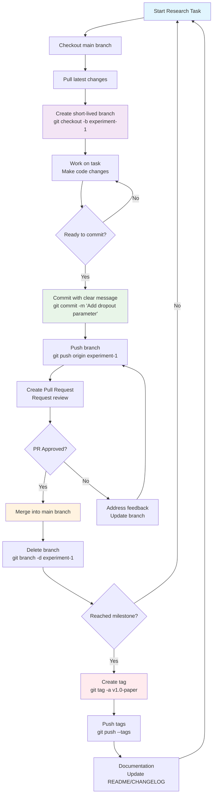
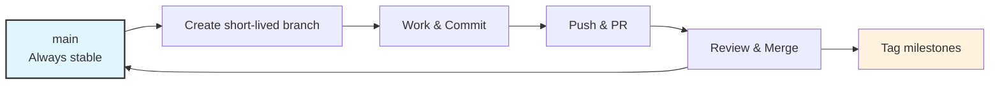
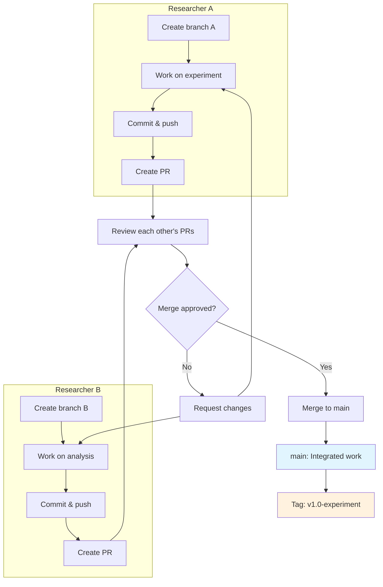

Here are the **Mermaid code blocks** for each flowchart:

## **1. Detailed Workflow Diagram**

## **2. Simplified Overview Diagram**

## **3. Alternative: Timeline View**

```mermaid
gantt
    title Research Git Workflow Timeline
    dateFormat HH:mm
    axisFormat %H:%M
    
    section Day 1
    Checkout main & sync :a1, 09:00, 15m
    Create branch :a2, after a1, 5m
    Implement changes :a3, after a2, 2h
    Commit changes :a4, after a3, 10m
    Push & create PR :a5, after a4, 5m
    
    section Day 1-2
    Review & feedback :b1, after a5, 4h
    Address feedback :b2, after b1, 1h
    
    section Day 2
    Merge to main :c1, after b2, 5m
    Delete branch :c2, after c1, 2m
    
    section Milestone
    Tag version :d1, after c2, 3m
```

---

## **4. Collaboration-Focused Diagram**

---

## **Usage Instructions:**

1. **Copy** any Mermaid code block
2. **Paste** into any Markdown file that supports Mermaid (GitHub, GitLab, Obsidian, VS Code with Mermaid extension)
3. **Render** automatically or use a Mermaid viewer
4. **Customize** colors, text, or structure as needed

Each diagram serves a different purpose:
- **Detailed**: Step-by-step tutorial
- **Simplified**: Quick reference
- **Timeline**: Understanding time expectations
- **Collaboration**: Team workflow visualization

Would you like me to create any other variations or explain specific parts of the Mermaid syntax?