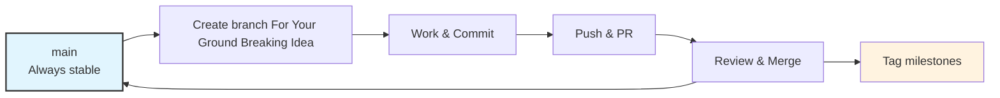
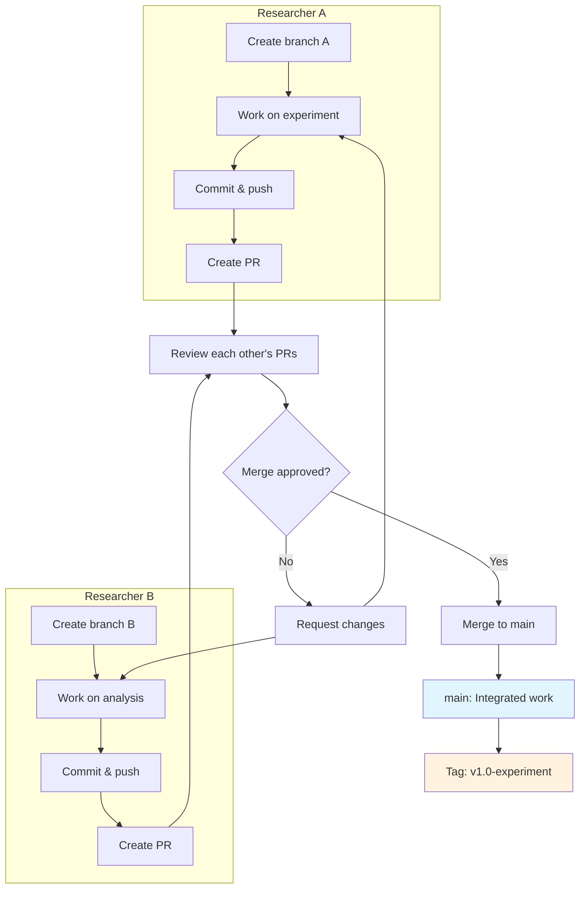

# Version Control and Git

> “I’m not a great programmer; I’m just a good programmer with great tools.” — Linus Torvalds

## Git clients and extensions:

- **Git (CLI)** — the canonical tool; learn the core commands below.
- **Git Fork** — GUI client: https://git-fork.com/
- **GitLens** — excellent VS Code extension: https://marketplace.visualstudio.com/items?itemName=eamodio.gitlens

## Quick Git Basic

Here are the essential commands to get started:

- **`git init`**: Initialize a new Git repository.
- **`git clone <url>`**: Clone a repository into a new directory.
- **`git status`**: Show the working tree status.
- **`git add <file>`**: Add file contents to the index (staging area).
- **`git commit -m "message"`**: Record changes to the repository.
- **`git push`**: Update remote refs along with associated objects.
- **`git pull`**: Fetch from and integrate with another repository or a local branch.
- **`git log`**: Show commit logs.
- **`git branch`**: List, create, or delete branches.
- **`git checkout <branch>`** / **`git switch <branch>`**: Switch branches or restore working tree files.
- **`git merge <branch>`**: Join two or more development histories together.

## Git Workflow For Research Project
Research Project share a lot of commonity of other software develpment project, however:
- Researchers do not deploy to production multiple times a day.
- Researchers do not have a fixed release plan, we are must like only create a a few release once project is finished or reach a milestone.
- Experiments produce figures, models, papers, they are not "merge immediately then deploy"
- Research tasks often need:
    - Multiple iteration cycles
    - Quick integration
    - Minimal isolation
    - Tags for preprint, revision, dataset versions

### What is a Git Branch?

A **branch** in Git is essentially a lightweight movable pointer to a commit. The default branch name in Git is `main` (or `master` in older repositories). As you make commits, the branch pointer moves forward automatically.

Think of it as a separate line of development. You can create a new branch to work on a new feature or fix a bug without affecting the main codebase. Once your work is done, you can merge that branch back into the main branch.

### Aligning Branches with Research Ideas

In research, a **branch** maps perfectly to a **hypothesis** or an **experiment**.

- **`main` branch**: Your stable baseline code that always runs.
- **Feature branch**: A specific experiment (e.g., `experiment/new-loss-function`, `idea/transformer-backbone`).

This isolation lets you test wild ideas without fear of breaking your reproducible codebase. If an idea fails, you just discard the branch. If it succeeds, you merge it. Persoanlly, I recommand use a branch only when 1. code change could break existing codebase, or 2. there is multiple people work on the same project.

### Workflow for One Man Army

Uses a **trunk-based development workflow**. That is All work is done in **Not So Short-Lived branches** that merge frequently into the mainline branch (**`main`**) - a.k.a trunk. It is common to just commit to `main` branch, it is not the best case but things are far less complicated if there is only one developer on the project. 



#### Commit 

Don’t Commit Large Data Files, Git slows down if large binary files are added.
Use:
- cloud storage
- data servers

Commit only:
- metadata
- configs
- scripts

Commit Often, Use concise, descriptive commit messages:

Commit Message examples:
- `Add dropout hyperparameter to model config`
- `Fix off-by-one error in data indexing`
- `Implement LR sweep experiment`
- `Update methods text in manuscript`

Avoid vague messages like “fix stuff” or “update file”.

#### Use Tags for “Published” States

Use Git tags to mark important scientific or development milestones:
```
git tag -a v0.1-preprint -m "Version for preprint submission"
git tag -a v1.0-paper -m "Final version matching accepted manuscript"
git push origin --tags
```

### Workflow for a Team

A **trunk-based development workflow** is in most time well fitted for research project. That is:
- **Single trunk (`main`)**: Always deployable and reproducible; no long-lived branches.
- **Not So Short-lived branches**: Few Day lifespan, 1 developer per branch, work is done in this branch, that merge frequently into the mainline branch (**`main`**) - a.k.a trunk. Note that `commit` and `tags` discussed in **one man army workflow** are still appied to this case.

This workflow is gear towards to ensure
- Continuous reproducibility  
- Minimal merge conflicts
- Incremental scientific development  
- Clean and traceable version history 

### Branching Model

**main** Branch：
- The single authoritative branch.  
- Must remain **runnable and stable** at all times.  
- All contributions merge into `main` through reviewed pull requests.

**develop** Branch
- In the case that there is a deployment requirement, keep main as the **runnable and stable**
- Use this branch to integrate latest change from each feature branch

**Not So Short-Lived Branches** branch：
- Every task should occur in its own temporary branch.
- These branch should be small in scope and focused on one change
- These branch shoul be Merged within a few days and Deleted after merging
- This is based on the idea of **Short-Lived** Branches, however nature of the research project means each of these branch would be as short-lived as their purely software development couter parts.

**Long-Lived Branches** branch:
- Idealy we should **not** have any long lived branch, because it will make merge code back to main branch a headache.
- Use this for refactoring code.
- **DO NOT** use this to store new features or new task, as switch between branch would be hard to deal with in a day-to-day base.

In a collabtrated team:



### Pull Request

PR requirements:
- Code runs without breaking existing functionality  
- Clear commit messages  
- Reviewer approval (if working collaboratively) 

### Collaboration Guidelines

- Never push directly to main
- Always use a branch + PR
- Keep PRs small and focused
- Document experimental branches
- Tag important analysis states
- Use Issues to track tasks and bugs


## Why Not Use a Feature-Based Workflow?

A traditional feature-based workflow (e.g., long-lived feature branches, Git Flow) is common in enterprise software but poorly suited for scientific research. In this model, developers create large, isolated branches that may live for weeks or months before merging. Although this approach can work for highly structured product development, it introduces several problems in computational research environments.


## Why Not Use a GitHub WorkFlow?

GitHub Flow is a lightweight branching model commonly used for web development and continuous deployment. It emphasizes simplicity and rapid integration. The core idea is that all work happens on short-lived branches that branch off from main. Once changes are tested and reviewed through a pull request, they are merged back into main and deployed immediately. Although GitHub Flow resembles trunk-based development, there are key differences in expectations and usage patterns.