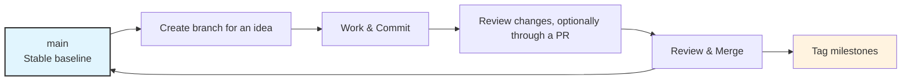
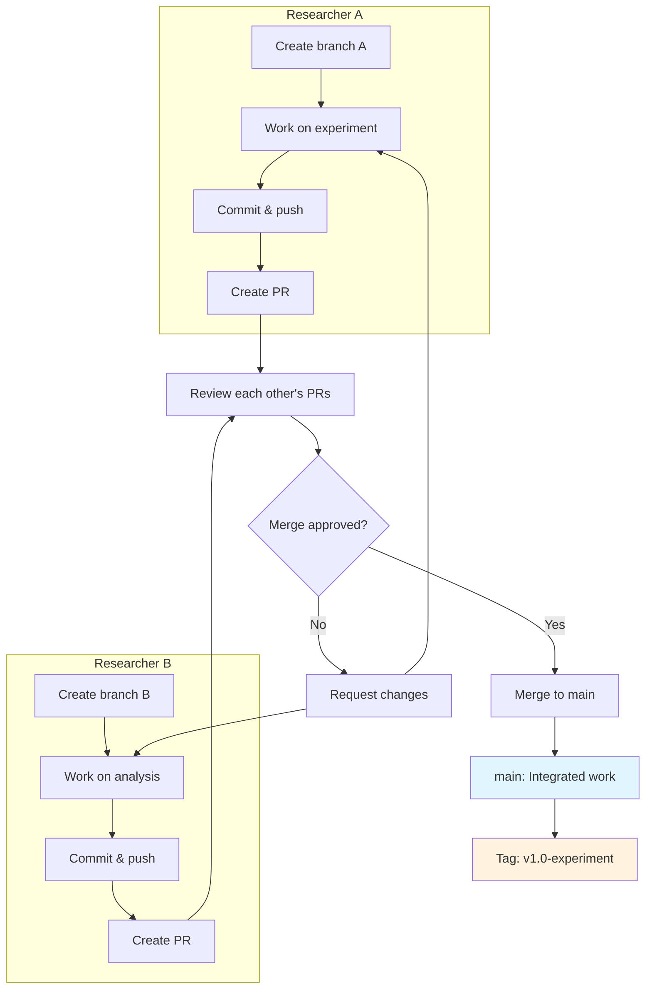

# Version Control and Git

> “I’m not a great programmer; I’m just a good programmer with great tools.” — Linus Torvalds

## Table of Contents

- [Git Clients and Extensions](#git-clients-and-extensions)
- [Essential Git Commands](#essential-git-commands)
- [Git Workflows for Research Projects](#git-workflows-for-research-projects)
    - [What is a Git Branch?](#what-is-a-git-branch)
    - [Aligning Branches with Research Ideas](#aligning-branches-with-research-ideas)
    - [Workflow for One Researcher](#workflow-for-one-researcher)
        - [Commit Small, Meaningful Changes](#commit-small-meaningful-changes)
        - [Use Tags for “Published” States](#use-tags-for-published-states)
    - [Workflow for a Team](#workflow-for-a-team)
        - [Branching Model](#branching-model)
        - [Pull Request](#pull-request)
        - [Collaboration Guidelines](#collaboration-guidelines)
- [Why Not Use a Feature-Based Workflow?](#why-not-use-a-feature-based-workflow)
- [Why Not Use GitHub Flow?](#why-not-use-github-flow)
- [Further Reading and Tools](#further-reading-and-tools)

## Git Clients and Extensions

- **Git (CLI)** — the canonical tool; learn the core commands below.
- **[Fork](https://git-fork.com/)** — graphical Git client.
- **[GitLens](https://marketplace.visualstudio.com/items?itemName=eamodio.gitlens)** — Git extension for Visual Studio Code.

## Essential Git Commands

Here are the essential commands to get started:

- **`git init`**: Initialize a new Git repository.
- **`git clone <url>`**: Clone a repository into a new directory.
- **`git status`**: Show the working tree status.
- **`git add <file>`**: Add file contents to the index (staging area).
- **`git commit -m "message"`**: Record changes to the repository.
- **`git push`**: Update remote refs along with associated objects.
- **`git pull`**: Fetch from and integrate with another repository or a local branch.
- **`git log`**: Show commit logs.
- **`git branch`**: List, create, or delete branches.
- **`git checkout <branch>`** / **`git switch <branch>`**: Switch to an existing branch.
- **`git merge <branch>`**: Join two or more development histories together.

## Git Workflows for Research Projects

Research projects share many needs with other software projects, but their milestones may be figures, models, datasets, or papers rather than production deployments. Choose a workflow that supports:

- Repeated experiment and revision cycles.
- Frequent integration of useful code changes.
- Temporary isolation for changes that could break the shared baseline.
- Tags for the code states used at scientific milestones.

### What is a Git Branch?

A **branch** in Git is essentially a lightweight movable pointer to a commit. As you make commits on a branch, its pointer moves forward automatically. This guide calls the main development branch `main`; the initial name depends on Git's version and configuration. When creating a new repository, `git init -b main` explicitly selects that name. See the [Git initialization documentation](https://git-scm.com/docs/git-init).

Think of it as a separate line of development. You can create a new branch to work on a new feature or fix a bug without affecting the main codebase. Once your work is done, you can merge that branch back into the main branch.

### Aligning Branches with Research Ideas

In research, a branch can isolate code changes needed to test a hypothesis or experiment. Runs that only change configuration values do not necessarily need separate branches.

- **`main` branch**: Your stable baseline code that always runs.
- **Feature branch**: A specific experiment (e.g., `experiment/new-loss-function`, `idea/transformer-backbone`).

This isolation lets you develop an idea without changing the shared baseline. Merge useful code after checking it. If an idea fails, retain any code and run records needed to explain the result before discarding the branch. Personally, I recommend using a branch when a change could break the existing codebase or when multiple people work on the project.

### Workflow for One Researcher

Use a simple workflow centered on `main`. For small, checked changes, committing directly to `main` can be practical when you are the only developer. For larger or disruptive changes, use a temporary branch and integrate small, working increments frequently. A pull request (PR), which proposes changes for review and merging, is optional for solo work but can provide a useful review record.

The diagram shows the branch-based option:


```mermaid
flowchart LR
    A[main<br>Stable baseline] --> B[Create branch for an idea]
    B --> C[Work & Commit]
    C --> D[Review changes, optionally through a PR]
    D --> E[Review & Merge]
    E --> A
    E --> F[Tag milestones]
    
    style A fill:#e1f5fe,stroke:#333,stroke-width:2px
    style F fill:#fff3e0
```

#### Commit Small, Meaningful Changes

Keep source material needed to understand and reproduce the work in Git. Typical tracked files include:

- Python modules and scripts.
- Tests and small test fixtures.
- Configurations and environment specifications or lock files.
- Documentation, manuscript source, and maintained notebooks.
- Small provenance records and data retrieval instructions.

Store large datasets, model files, and generated outputs in a documented, durable location, such as institutional data storage. See [Research Data and Run Outputs](02_Project_Structure.md#research-data-and-run-outputs) for storage and provenance guidance, and [Git Hygiene](02_Project_Structure.md#git-hygiene) for exclusions.

Commit small, meaningful changes often and use concise, descriptive messages. Examples:

- `Add dropout hyperparameter to model config`
- `Fix off-by-one error in data indexing`
- `Implement LR sweep experiment`
- `Update methods text in manuscript`

Avoid vague messages like “fix stuff” or “update file”.

#### Use Tags for “Published” States

Use Git tags to mark important scientific or development milestones. An annotated tag records a name and message for a particular commit; without an explicit commit argument, it targets the current `HEAD`. It does not capture uncommitted edits or external datasets. See the [Git tag documentation](https://git-scm.com/docs/git-tag).

These examples work in Bash or PowerShell from an existing repository. They assume a configured Git identity, a writable remote named `origin`, and unused example tag names. First commit and verify the intended milestone state, then create and publish its tag. At preprint submission:

```bash
git tag -a v0.1-preprint -m "Version for preprint submission"
git push origin tag v0.1-preprint
```

Later, after committing and verifying the changes for the accepted manuscript, tag that state:

```bash
git tag -a v1.0-paper -m "Final version matching accepted manuscript"
git push origin tag v1.0-paper
```

Each push publishes only the named tag and the objects it needs. Avoid `git push origin --tags` when you only intend to publish one milestone, because it pushes all local tags. See the [Git push documentation](https://git-scm.com/docs/git-push). Preserve the environment, configuration, seeds where applicable, input provenance, and output location with the run records; a code tag alone is insufficient to reproduce a result.

### Workflow for a Team

A **trunk-based development workflow** can suit research teams that want to integrate changes frequently into one shared branch, the trunk (`main`). Keep change branches short-lived: aim for a couple of days and split larger tasks into working increments. The [trunk-based development guide](https://trunkbaseddevelopment.com/short-lived-feature-branches/) describes this integration model. An experiment may run for weeks without requiring its code changes to remain unmerged for that duration.

Frequent integration may reduce the size of merge conflicts and make review easier. It does not guarantee reproducibility: retain run metadata and check the integrated code. The commit and tagging guidance for one researcher also applies here.

#### Branching Model

- **`main`**: The shared integration branch. Keep it runnable and stable through appropriate checks and reviewed pull requests.
- **Temporary change branches**: Keep each branch focused on one change, including features, fixes, and refactoring. Merge checked increments frequently and delete branches after merging.
- **Exceptions**: A disruptive investigation may need longer isolation. Document why, keep it synchronized with `main`, and plan how useful changes will be integrated. Treat this as an exception, not the default refactoring workflow.

This default uses no separate `develop` branch. A deployment requirement alone does not require one. Add a separate integration or maintenance branch only when the project has a specific need, and document its purpose and merge direction as an alternative workflow.

For a collaborating team:


```mermaid
flowchart TB
    subgraph "Researcher A"
        A1[Create branch A] --> A2[Work on experiment]
        A2 --> A3[Commit & push]
        A3 --> A4[Create PR]
    end
    
    subgraph "Researcher B"
        B1[Create branch B] --> B2[Work on analysis]
        B2 --> B3[Commit & push]
        B3 --> B4[Create PR]
    end
    
    A4 --> C[Review each other's PRs]
    B4 --> C
    
    C --> D{Merge approved?}
    D -->|Yes| E[Merge to main]
    D -->|No| F[Request changes]
    F --> A2
    F --> B2
    
    E --> G[main: Integrated work]
    G --> H[Tag: v1.0-experiment]
    
    style G fill:#e1f5fe
    style H fill:#fff3e0
```

#### Pull Request

For this team workflow, agree on PR requirements such as:

- Relevant checks pass and existing functionality still works.
- The description explains the change and how it was validated.
- Commit messages are clear.
- Another team member reviews and approves the change.

#### Collaboration Guidelines

For teams adopting this workflow:

- Use a branch and reviewed PR for contributions to `main`.
- Keep PRs small and focused.
- Document experimental branches and any need for longer isolation.
- Tag important analysis states.
- Use issues to track tasks and bugs.


## Why Not Use a Feature-Based Workflow?

Feature branches are compatible with the workflow above. The useful comparison is how long changes remain isolated and how much work accumulates before review. Short, focused branches support frequent integration; branches that diverge for weeks may require more reconciliation and larger reviews.

Git Flow is a distinct model with separate development and release-related branches, not a synonym for feature branches. Its additional structure may help projects maintaining versioned releases, but also adds branches and merge paths to manage. Use it when those release needs justify the maintenance burden. See the [original Git Flow description and its author's subsequent guidance](https://nvie.com/posts/a-successful-git-branching-model/).


## Why Not Use GitHub Flow?

GitHub Flow is a reasonable choice for research projects. Its branch, review, and merge process closely matches the team workflow above, and it does not require immediate deployment after merging. See [GitHub's workflow documentation](https://docs.github.com/en/get-started/using-github/github-flow).

Use it when pull requests help the team discuss and check changes. Keep branches short-lived if frequent integration is the goal, and use tags and archived run records for scientific milestones. A solo researcher can choose the simpler direct-to-`main` option described earlier.

## Further Reading and Tools

- [Git command reference](https://git-scm.com/docs).
- [Pro Git book](https://git-scm.com/book/en/v2).
- [pre-commit](https://pre-commit.com/).
