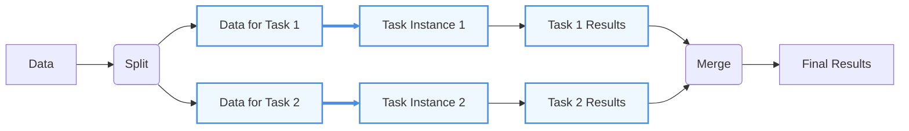
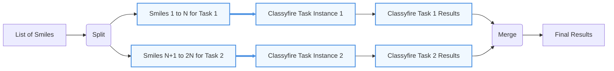
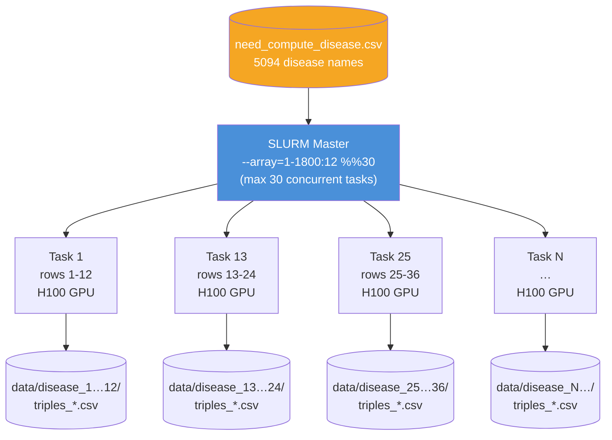
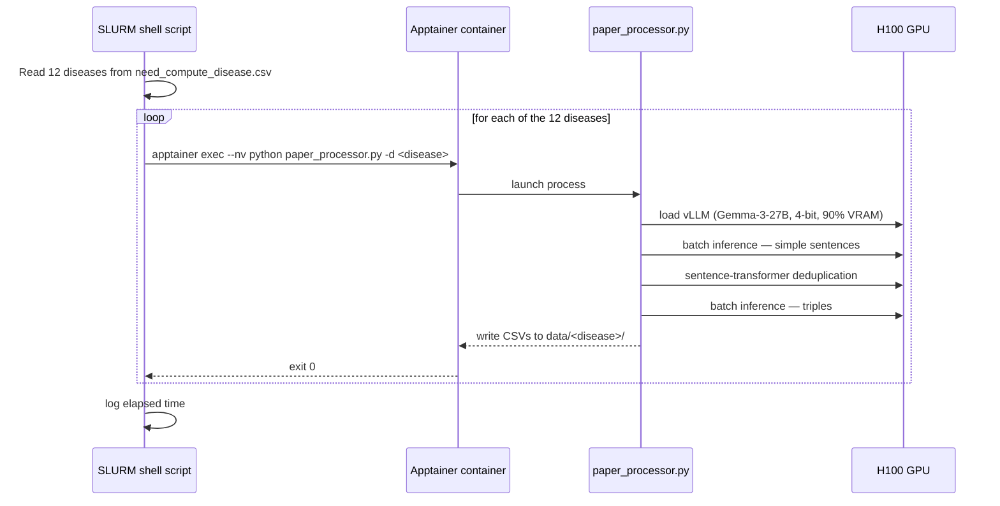
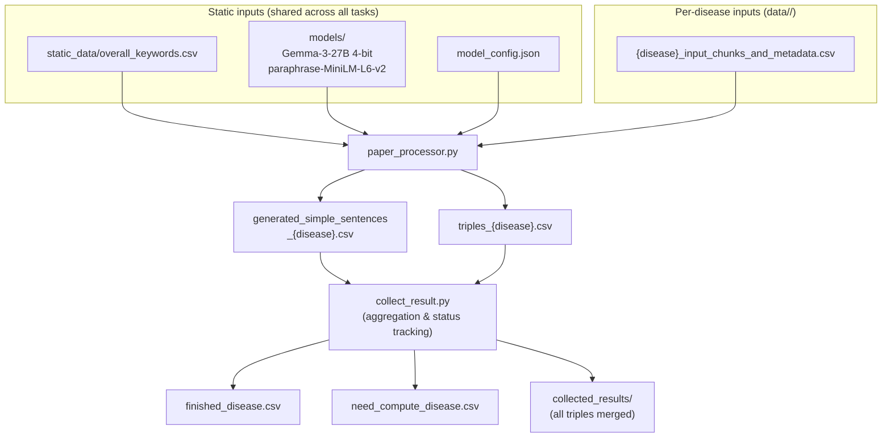

# Go With Large Scale

Use this checklist when planning and running experiments at scale on HPC clusters, cloud platforms, or distributed systems. The goal is to reduce failure risk, improve reproducibility, control cost, and ensure that results from small-scale tests can be reliably expanded to full-scale production runs.

---

## Project Plan & Requirements

Before scaling, clearly define the project goal, expected outputs, data volume, performance targets, and available budget or compute allocation.

This should answer:

- What are we trying to achieve?
- What outputs must be generated?
- How many samples/files will be processed?
- How much storage is required?
- How long should the full run take?
- What failure rate is acceptable?
- What compute budget or HPC allocation is available?

This step ensures that the planned workflow matches the available compute, storage, time, and budget before launching large-scale runs.


## 0. Parallelization
Before scaling, design the workflow so that large jobs are broken into smaller independent unit tasks. Parallelization should be **data-driven**, meaning the structure of the dataset should determine how tasks are split. That is work will be divided into independent tasks that can run at the same time in parallel. Ideally, each task should use a similar amount of wall time for easy task schecudling. Common ways to parallelize include:

- By sample/inputs
- By file of inputs
- By training experiment


**Figure:** Illustration of a data‑driven parallel workflow. The pipeline starts from an initial `Data` node that is split into two independent branches (`Task 1` and `Task 2`), which can be executed concurrently (e.g., two model inferences or feature‑extraction pipelines). Each branch produces a separate result (`Result 1` and `Result 2`), which are then merged into a final `Results` node, representing aggregation, ensemble computation, or any downstream operation on the combined outputs. Note that Task->Reults is a independent unit task, each of these unit task can be parallelizated.

### Classyfire Example
For example, when running ClassyFire [[https://bitbucket.org/wishartlab/classyfire-batch-runner/src/master/]], compound classification can often be parallelized by splitting the input dataset into smaller compound batches. Each batch can run as an independent unit task, producing a separate classification output. After processing, the batch-level results can be merged into one final annotated compound table. The batch size should be selected based on benchmark results, API or server limits, runtime, memory use, and failure rate. 



### RADOR Setup  
For example, when running RADOR [[https://bitbucket.org/wishartlab/rador/src/main]], the disease input list can be divided into smaller independent tasks, where each task processes text inputs for a defined number of diseases. Each task is assigned a fixed wall time, such as 3 hours. After completion or timeout, a script merges finished results and updates the to-do list so that unfinished diseases can be submitted in the next round. This supports checkpoint-style parallelization and avoids rerunning completed work.

RADOR does not use PyTorch DDP (gradient-synchronised multi-GPU training). All models are frozen at inference time — there are no gradients to synchronise. Instead, the pipeline scales horizontally via **SLURM job arrays**: each independent job owns one H100 GPU and processes a fixed slice of diseases sequentially. Tasks share no state and never communicate with each other.

#### 1. SLURM Job-Array Architecture

Each SLURM array task (`--array=1-1800:12%30`) receives 12 consecutive disease names from `need_compute_disease.csv` (line 35 of `slurm_scripts/slurm_fir_apptainer_arr_dw.sh`). Up to 30 tasks run concurrently, giving a theoretical peak of 30 H100 GPUs working in parallel.



> No inter-task communication exists. Each task writes its results to a dedicated subdirectory under `data/` and exits independently.

#### 2. Single-Task Execution Flow

Inside one SLURM task, the shell script iterates over its 12 diseases sequentially, launching a fresh Apptainer container for each call to `paper_processor.py` (lines 76-84 of the SLURM script).



#### 3. Per-Disease Pipeline (paper_processor.py)

Each call to `paper_processor.py` runs ten sequential steps on a single GPU. There are two vLLM inference passes and one embedding pass.

```mermaid
flowchart LR
    A["Step 1\nParse args\n& load config"]
    B["Step 2\nLoad input chunks\nfrom CSV"]
    C["Step 3\nKeyword filter\nchunks"]
    D["Step 4\nLoad vLLM model\nGemma-3-27B 4-bit"]
    E["Step 5\nvLLM inference\n→ simple sentences\nbatch_size=128"]
    F["Step 6\nSentence-transformer\ndeduplication\nthreshold=0.95"]
    G["Step 7\nSave simple\nsentences CSV"]
    H["Step 8\nvLLM inference\n→ triples"]
    I["Step 9\nFormat &\nclean triples"]
    J["Step 10\nSave triples CSV\n& log stats"]

    A --> B --> C --> D --> E --> F --> G --> H --> I --> J

    style D fill:#e74c3c,color:#fff
    style E fill:#e74c3c,color:#fff
    style F fill:#8e44ad,color:#fff
    style H fill:#e74c3c,color:#fff
```



#### 4. Data Flow



#### 5. GPU Resource Layout (single task)

One SLURM task maps to exactly one H100 GPU. vLLM consumes 90 % of VRAM for the LLM; the sentence-transformer occupies the remaining headroom.

| Component                  | Value                                       | Source                               |
| -------------------------- | ------------------------------------------- | ------------------------------------ |
| LLM                        | `unsloth/gemma-3-27b-it-unsloth-bnb-4bit` | `model_config.json`                |
| Quantisation               | BitsAndBytes 4-bit                          | `model_config.json`                |
| `gpu_memory_utilization` | 0.90                                        | `model_config.json`                |
| `tensor_parallel_size`   | 1 (single GPU)                              | `model_config.json`                |
| Inference batch size       | 128                                         | `model_config.json`                |
| Dedup similarity threshold | 0.95 cosine                                 | `model_config.json`                |
| Diseases per SLURM task    | 12                                          | `slurm_fir_apptainer_arr_dw.sh:33` |
| Max concurrent SLURM tasks | 30                                          | `slurm_fir_apptainer_arr_dw.sh:16` |

### Question to ask
Parallelization planning should define:

- The smallest independent unit of work
- How many jobs can run simultaneously
- How data will be split across jobs
- How outputs will be merged after processing
- How failed jobs will be detected and rerun


## 1. Data Strategy

Define how data will be stored, moved, processed, and archived before scaling.

For each data source, record:

- Source name and location
- File type
- Number of files
- Total size
- Expected processed/intermediate size
- Required metadata
- Whether the data must stay on the compute system or can be archived locally

Example:

| Data category | Number of files | Estimated size | Storage decision |
|---|---:|---:|---|
| Raw input data | 5,000 | 4 TB | Archive after validation |
| Processed data | 5,000 | 6 TB | Keep on compute system |
| Reference database | 1–10 | 500 GB | Keep on compute system |
| Model checkpoints | 200 | 2 TB | Keep recent, archive old |
| Logs and metrics | 10,000 | 100 GB | Archive after run |
| Final outputs | 500 | 200 GB | Keep and back up |

**Data should also be organized to support parallelization.** For example, files can be separated by sample, accession, batch, model run, or task ID.

### Decide where each data type should be stored

Before running large-scale jobs, define where each type of data should live. Storage location should depend on how often the data are accessed, whether they are shared across tasks, and whether they are temporary or final outputs.

| Data type | Recommended location | Reason |
|---|---|---|
| Raw input data | Local/archive storage after validation | Usually large and not repeatedly needed after processing |
| Active input data | HPC/cloud scratch or working directory | Needed directly by running jobs |
| Shared data between tasks | Shared project storage or read-only shared directory | Used by many tasks and should not be duplicated for every job |
| Reference databases | Shared compute/project storage | Reused by many jobs, such as taxonomy, genome, chemistry, or model databases |
| Metadata/config files | Shared project storage | Needed by all tasks for consistent sample labels, parameters, and run settings |
| Processed data | Project storage | Needed for downstream analysis |
| Temporary files | Scratch/tmp storage | Can be deleted after jobs finish |
| Model checkpoints | Compute storage for recent checkpoints; archive older ones | Needed for recovery, but can grow quickly |
| Logs and metrics | Project storage, then archive | Needed for debugging and reproducibility |
| Final outputs | Project storage plus backup/local copy | Important results should be preserved |

### Use file-based databases for portable task execution

For large-scale SLURM workflows, prefer a file-based database, such as SQLite, JSONL, Parquet, HDF5, or DuckDB, instead of a central MySQL database when possible. File-based databases are easier to move, copy, version, and reproduce across task directories.

This is useful when each task needs access to the same reference data, lookup table, compound list, disease list, or intermediate task state.

Recommended pattern:

- Store the master file-based database in a shared project directory.
- Treat the master copy as read-only during parallel runs.
- For each SLURM task, copy the required database file into the task working directory if local access improves speed or avoids file-locking issues.
- Let each task write its own output file or task-specific database.
- Merge task outputs after the run finishes.

### Consider I/Os

## 2. Compute Resources

Compute planning should start by benchmarking one representative unit task, then scaling that estimate to the full workflow.

### Determine resource usage for one unit task

First define the unit task, such as one sample, one accession, one compound batch, one disease batch, one model run, or one cross-validation fold.

For each unit task, measure:

- Runtime
- CPU cores used efficiently
- Peak memory usage
- GPU usage, if needed
- Temporary storage generated
- Final output size
- Disk I/O intensity
- Failure rate or timeout risk

This should be measured using small benchmark runs, not estimated only from software documentation.

Example:

```text
Unit task: process one compound batch
Input size: 10,000 compounds
CPU request: 8 cores
Effective CPU use: 4–6 cores
Peak memory: 12 GB
Runtime: 2 hours
Temporary storage: 20 GB
Output size: 2 GB
```
### Break tasks into shorter wall-time jobs

When possible, design unit tasks so they can finish within a shorter wall-time limit. Shorter jobs are usually easier to schedule on HPC systems and may wait less time in the queue than very long jobs.

Instead of submitting one large job that runs for many hours or days, split the work into smaller independent tasks. However, the task should not be so small that most of the runtime is spent loading the environment, importing libraries, loading models, or initializing databases.

For example:

| Design | Issue |
|---|---|
| One job for 1,000 inputs with 48-hour wall time | Harder to schedule; failure loses more progress |
| 100 jobs with 10 inputs each and 2–3-hour wall time | Easier to queue; failed tasks are easier to rerun |

Each task should have:

- A clear input chunk
- A defined wall-time limit
- Its own working directory
- Its own output file
- A log file
- A way to detect whether it finished successfully

```text
Load model → process 1 input → exit
Load model → process 1 input → exit
Load model → process 1 input → exit

Better design:
Load model once → process 100 inputs → write output → exit
```

## 3. Environment & Packaging

Large-scale runs must use reproducible software environments.

### Containerize the environment

Use containers such  Apptainer/Singularity for HPC.  Containers help ensure that the same software versions, dependencies, and system libraries are used across machines. [[./docs/13_Apptainer_Compute_Canada.md]]

## 4. Experiment Reproducibility

Reproducibility means that the same experiment can be rerun and produce the same or comparable results.

### Save configurations for each run

Each run should have a saved configuration file.

This may include:

- Input dataset path
- Output path
- Model parameters
- Training parameters
- Random seed
- Number of epochs
- Batch size
- Learning rate
- Software version
- Container version
- Date and time of run

Example:

```yaml
run_id: experiment_001
dataset: data/processed/v1
model: xgboost
seed: 42
train_split: 0.8
learning_rate: 0.01
output_dir: outputs/experiment_001
```

This prevents confusion when comparing different runs.

### Fix random seeds

Random seeds should be fixed where possible.

This applies to:

- Train/test splitting
- Cross-validation
- Model initialization
- Data shuffling
- Random sampling
- Deep-learning training

Example:

```python
import random
import numpy as np

random.seed(42)
np.random.seed(42)
```

For GPU-based deep learning, complete reproducibility may still be difficult, but setting seeds reduces variability.

### Log environment metadata

Each run should record the compute and software environment.

This includes:

- Hostname
- Operating system
- CPU type
- GPU type
- RAM
- Python version
- Package versions
- Container version
- Git commit ID
- Job ID

This helps explain differences between runs.

### Use experiment tracking

Use a system to track experiments.

Options include:

- MLflow
- Weights & Biases
- TensorBoard
- Plain structured logs
- CSV/JSON logs

Track:

- Parameters
- Metrics
- Runtime
- Model checkpoints
- Figures
- Tables
- Logs
- Final artifacts

This is especially important when running many experiments in parallel.

---

## 5. Monitoring, Logging & Alerts

Large-scale experiments need active monitoring.

### Centralize logs and metrics

Logs should be stored in a predictable location.

Example:

```text
logs/
├── preprocessing/
├── training/
├── evaluation/
└── failed_jobs/
```

Each job should write:

- Start time
- End time
- Input file name
- Output file name
- Parameters
- Runtime
- Resource usage
- Error messages

Centralized logs make debugging much easier.

### Add alerts for failures

Large runs may fail while no one is watching.

Useful alerts include:

- Job failed
- Runtime exceeded expected time
- Memory exhausted
- GPU out of memory
- Output file missing

## 6. Profiling & Optimization

Profiling identifies bottlenecks before scaling.

### Profile medium runs before full-scale execution

A medium-size run should be used to measure:

- CPU utilization
- GPU utilization
- Memory usage
- Disk I/O
- Network I/O
- Data-loading time
- Training time
- Preprocessing time

This shows whether the bottleneck is compute, memory, storage, or data transfer.

For example:

- Low CPU usage may indicate slow disk I/O.
- Low GPU usage may indicate slow data loading.
- High memory usage may indicate inefficient data structures.
- Slow runtime may be caused by too many small files.

### Benchmark common operations

Benchmark repeated operations before full-scale execution.

Examples:

- File reading
- File writing
- Data loading
- Compression/decompression
- Feature extraction
- Model training
- Database lookup
- Matrix operations
- Checkpoint saving

Small optimizations can have large effects at scale.

For example:

> Saving one minute per sample saves approximately 1,000 minutes when processing 1,000 samples.

### Optimize bottlenecks

Optimization may include:

- Increasing batch size
- Reducing unnecessary file writing
- Using faster storage
- Reducing checkpoint frequency
- Combining small files
- Using job arrays
- Using multiprocessing
- Caching reference data
- Using efficient file formats such as Parquet, HDF5, or Zarr
- Avoiding repeated downloads
- Avoiding repeated preprocessing

Optimization should be based on profiling results, not assumptions.

---

## 7. Documentation & Runbooks

Documentation ensures that the workflow can be repeated and debugged by other people.

### Write onboarding documentation

The documentation should explain:

- Project structure
- Input data requirements
- How to install or load the environment
- How to run a small test
- How to submit a full run
- Where outputs are stored
- How to interpret logs
- How to rerun failed jobs

Example documentation structure:

```text
docs/
├── 01_project_overview.md
├── 02_data_setup.md
├── 03_environment_setup.md
├── 04_run_pipeline.md
├── 05_monitoring.md
└── 06_troubleshooting.md
```

Good documentation reduces dependency on one person and improves reproducibility.

### Keep runbooks for common failures

A runbook is a practical troubleshooting guide.

It should describe common problems and how to fix them.

| Problem | Likely cause | Action |
|---|---|---|
| Job killed | Memory exceeded | Increase RAM or reduce batch size |
| Disk full | Too many temporary files | Clean temp files or request more storage |
| GPU out of memory | Batch size too large | Reduce batch size |
| Missing output | Job failed silently | Check logs and rerun sample |
| Slow runtime | I/O bottleneck | Move data to faster scratch storage |
| Checkpoint missing | Save path incorrect | Verify output directory |

Runbooks are especially useful when multiple people are running the workflow.

---

## Final Clean Checklist

Use this checklist before moving from small-scale experiments to large-scale production runs.

| Section | Key purpose |
|---|---|
| Project plan & requirements | Define goals, scale, performance targets, and budget |
| Parallelization | Decide how work will be split into independent jobs |
| Data strategy | Track data sources, sizes, storage needs, and file organization |
| Compute resources | Select HPC/cloud/local resources and estimate usage |
| Environment & packaging | Ensure reproducible software using containers and locked environments |
| Experiment reproducibility | Save configs, seeds, metadata, and run artifacts |
| Monitoring, logging & alerts | Track failures, resource use, metrics, and runtime |
| Profiling & optimization | Find bottlenecks before full-scale execution |
| Documentation & runbooks | Make the workflow repeatable and easier to debug |

This structure makes large-scale experimentation safer, more reproducible, and easier to manage.
