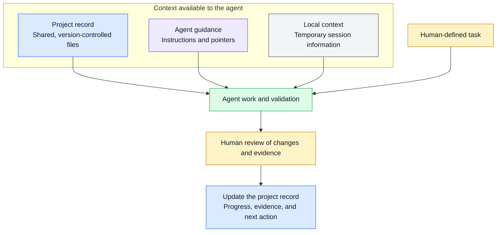
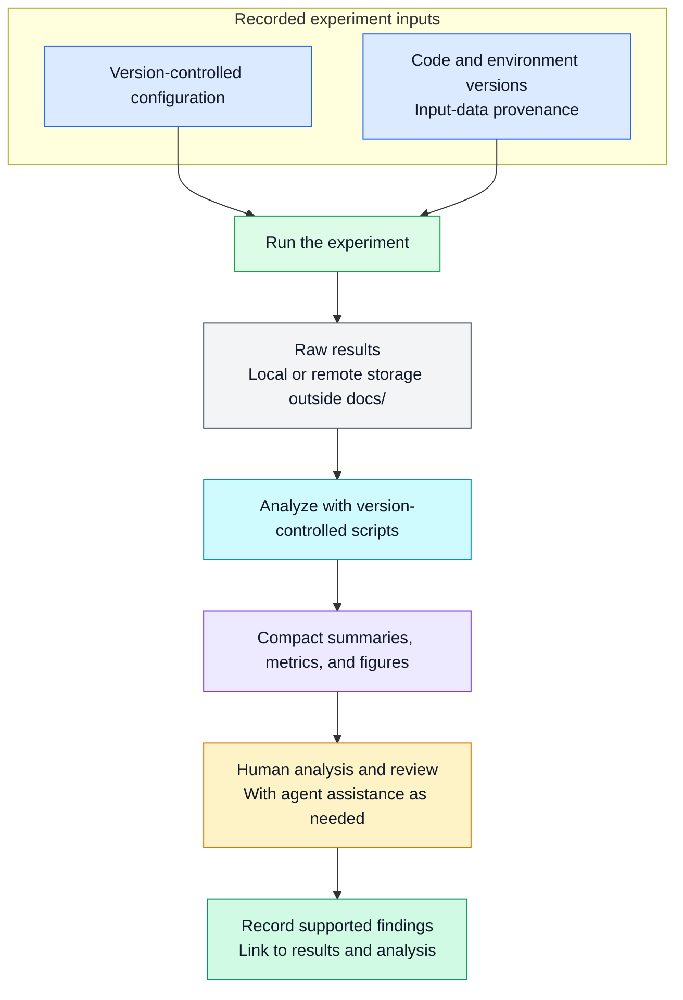
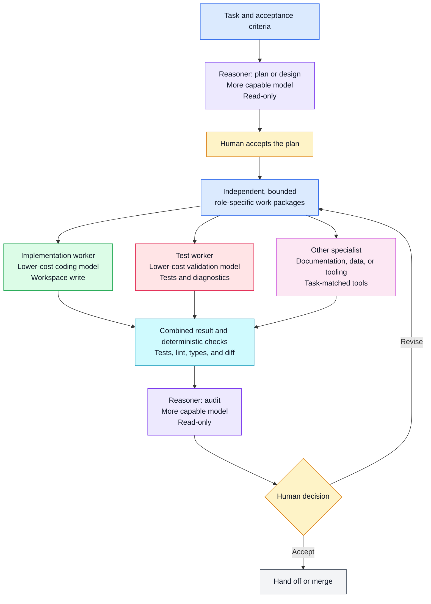

# Agentic Research Workflow: Knowledge, Rules, and Plans

This section follows a sample project that trains image classifiers from sample
manifests. The task is to reject duplicate sample IDs before constructing a
dataset. This continues the example in
[guide section 14](14_Programming_with_LLM_Agents.md#task-requests).
The setup, plans, prompts, and reusable workflow below all use this task.

The workflow applies across LLM agents. The supplementary
[shared documentation examples](../examples/agentic_coding/docs/) contain
the image-classifier architecture and sample plan, plus rules from a Python
mass-spectrometry project that need adaptation before use here. Agent-specific
examples include an [AGENTS.md entry point](../examples/agentic_coding/AGENTS.md)
for Codex and [claude/](../examples/agentic_coding/claude/) for Claude Code.
For a Copilot entry-point template, see the
[Copilot example in guide section 14](14_Programming_with_LLM_Agents.md#copilot-example).

LLM-agent products change frequently. Verify tool-specific feature details in the
official documentation for the agent being configured.

## Table of Contents

1. [The Idea](#the-idea)
   - [Project Record](#project-record)
   - [Agent Guidance](#agent-guidance)
     - [Configure Subagents by Role](#configure-subagents-by-role)
   - [Local Context](#local-context)
2. [Step-by-Step Setup](#step-by-step-setup)
3. [An Agent-Assisted Task Example](#an-agent-assisted-task-example)
4. [Reusable Workflows](#reusable-workflows)
5. [System Audit](#system-audit)
6. [Further Reading](#further-reading)

## The Idea

The core idea of this workflow is to let **large language model (LLM) agents**
continue work across sessions while keeping a human in control.
Version-controlled documentation holds shared project memory, such as knowledge,
project rules, and plans. **Humans remain responsible for scientific decisions,
consequential actions, and final results.** Humans should track and verify all
project records.

Both an LLM agent and a human need information to perform each task well. This information falls into three categories:

1. **Project record:** Version-controlled knowledge, plans, project rules, and
   research working notes shared by humans and LLM agents. These records help
   teams track tasks, results, decisions, and setup procedures, even when no LLM
   agent is involved.
2. **Agent guidance:** Information about how an agent finds information and
   works. These instructions explain how work must be performed and which
   actions are prohibited. Some rules and engineering choices exist specifically
   to reduce the impact of LLM errors and fabricated claims.
3. **Local context:** Temporary task context, such as chat history and local
   memory. Local context can help an agent continue, but it is not a durable or
   shared record.



**Figure 1.** Read from top to bottom: the agent uses three sources of context to
perform a human-defined task. Review and record updates prepare the next session.
The final update goes into the same project record shown at the top.

### Project Record

The `docs/` directory is the tool-neutral project record. Its files separate
stable project knowledge from changing plans and findings:

| Path                     | Contents                                                                                  |
| ------------------------ | ----------------------------------------------------------------------------------------- |
| `docs/architecture.md` | Components, entry points, interfaces, and data flow                                       |
| `docs/knowledge/`      | Project explanations and reusable procedures for development, experiments, and operations |
| `docs/findings/`       | Verified observations, measurements, negative results, and conclusions                    |
| `docs/plans/`          | Task objectives, steps, status, progress, blockers, and validation evidence               |
| `docs/rules/`          | Shared scientific, data-handling, and engineering constraints                             |

When a workflow uses more than one model, record the routing rule with the task
plan or workflow: the task category, chosen model or capability tier, input and
tool requirements, acceptance checks, and when to escalate a task. For example,
a smaller model may handle a fixed-format extraction step, while a more capable
model investigates an ambiguous failure. Do not route by model size alone;
compare candidates on representative work using the same checks, latency, and
cost limits. Revisit the rule when the task, provider model catalog, or measured
quality changes. [OpenAI's model-selection guide](https://developers.openai.com/api/docs/guides/model-selection)
is one current provider reference for matching capabilities to workloads.

Keep each fact in one canonical file and link to it elsewhere. Use `README.md`
for setup and navigation, and use `docs/` for detailed project knowledge. This
keeps the record accessible to humans and agents without tying it to one tool's
memory format.

#### Plans and Experiment Records

A plan is the durable record for a task or investigation, from proposal through
completion or abandonment. Keep its objective, steps, status, progress, evidence,
open questions, and next action together in `docs/plans/`. Update that document
as work proceeds; no separate task-state file or project-state index is needed.

##### Task Plans

Use a status banner and an updated date on each plan. Choose from these statuses:

| Status      | Meaning                                                               |
| ----------- | --------------------------------------------------------------------- |
| PROPOSED    | Work is defined but has not started.                                  |
| IN PROGRESS | Work is underway, including validation or review.                     |
| BLOCKED     | Work cannot proceed until a named dependency or question is resolved. |
| COMPLETED   | Acceptance criteria, required checks, and review are satisfied.       |
| ABANDONED   | Work stopped without completion; record why and any useful results.   |
| SUPERSEDED  | Another plan replaces this one; link to its successor.                |

Update the plan at meaningful checkpoints. Distinguish facts from unresolved
questions, record validation evidence, and preserve stopped plans with their
reasons. On resumption, compare the plan with the current Git revision, working
tree, and linked experiment records.

##### Experiment Records

Use a version-controlled configuration file as the main description of a run.
It should capture parameters, command-line options, random seeds, and other
settings needed to repeat the experiment. The experiment record should link that
configuration to the code and environment versions, input-data provenance, run
status, and output location.

Keep raw results outside `docs/` and usually outside the Git repository. They may
live in an artifact store, experiment-tracking system, or other remote service;
record a stable path or identifier without storing credentials.

Do not pass complete raw datasets, logs, or result collections directly to an
LLM. Build version-controlled tools or scripts that load, validate, and
summarize the raw outputs as a researcher would. Humans and agents can then work
from the same compact summaries, metrics, and figures. Provide only the minimal
diagnostic excerpts needed for a specific task while the complete raw results
remain in their documented storage location.



**Figure 2.** Read from top to bottom: recorded inputs define the run, and scripts
turn stored outputs into compact evidence for analysis and review. Raw results
remain in their storage location; supported findings enter the project record.

### Agent Guidance

Agent guidance tells an LLM agent where to find the project record and how to
operate. Each LLM-agent tool may have a preferred instruction file. Use that file
as a thin entry point containing information the LLM agent needs in nearly every
session. For Claude Code, this is `CLAUDE.md` or `.claude/CLAUDE.md`; Codex uses
`AGENTS.md`; GitHub Copilot can use `.github/copilot-instructions.md`. Other
LLM-agent tools may use another format.

| Tool           | Repository entry point                 | More specific guidance                              |
| -------------- | -------------------------------------- | --------------------------------------------------- |
| Claude Code    | `CLAUDE.md` or `.claude/CLAUDE.md` | Nested `CLAUDE.md` files and `.claude/rules/`    |
| Codex          | `AGENTS.md`                          | Nested `AGENTS.md` or `AGENTS.override.md` files |
| GitHub Copilot | `.github/copilot-instructions.md`    | `.github/instructions/*.instructions.md`          |

Claude Code and Codex both combine instructions according to their own discovery
rules. Do not assume that nesting, precedence, or import syntax is identical.
Verify the behavior in the tool's current documentation.

The entry point should directly state:

- the project's purpose and main scientific task; and
- a small set of universal workflow rules for agents.

For the following information, the entry point may either provide a concise
summary or point to the canonical file or directory:

- project documentation;
- the supported environment and routine validation commands;
- important architectural boundaries; and
- locations and policies for data, configurations, and results.

Keep detailed or frequently changing information in the shared project record.
The entry point should tell the agent where the authoritative information lives
and when to read it, rather than duplicate it.

#### Scoped Instructions

Use scoped instructions only for language-, directory-, or task-specific rules.
Claude Code uses `.claude/rules/`; Codex uses nested `AGENTS.md` files and
`AGENTS.override.md`. Keep shared constraints in `docs/rules/` and make scoped
files point to them. Codex `.rules` files control command permissions and are not
substitutes for project knowledge.

#### Configure Subagents by Role

A subagent is a separate agent thread that the main session delegates a bounded
task to. Both Codex and Claude Code let a project define named subagent roles in
version-controlled files and give each role its own model and reasoning effort.

A useful starting pattern is to reserve a more capable model and higher
reasoning effort for judgment-heavy work such as planning, architecture, and
audit, then give a faster, lower-cost model a bounded implementation task with
explicit checks. This is a routing heuristic, not a guarantee: compare both
roles on representative tasks and move work to the stronger model when the
worker misses requirements or cannot complete the checks. Record the routing
rule you settle on with the task plan, as described in
[Project Record](#project-record).

| Agent       | Project roles       | User roles            | Role file format               |
| ----------- | ------------------- | --------------------- | ------------------------------ |
| Codex       | `.codex/agents/`    | `~/.codex/agents/`    | TOML                           |
| Claude Code | `.claude/agents/`   | `~/.claude/agents/`   | Markdown with YAML frontmatter |

Check the current documentation for model names, supported reasoning levels, and
configuration fields before adapting the examples below. Both products change
these frequently.

##### Codex Subagent Roles

The following current Codex example sets a lower-cost default for spawned
agents, then overrides it for a read-only reasoning role. See the
[Codex subagent documentation](https://learn.chatgpt.com/docs/agent-configuration/subagents).

In `.codex/config.toml`:

```toml
[agents]
enabled = true
max_concurrent_threads_per_session = 4
default_subagent_model = "gpt-5.6-terra"
default_subagent_reasoning_effort = "medium"
```

In `.codex/agents/reasoner.toml`:

```toml
name = "reasoner"
description = "Read-only planner, designer, and auditor for consequential or ambiguous changes."
model = "gpt-5.6"
model_reasoning_effort = "high"
sandbox_mode = "read-only"
developer_instructions = """
Inspect the repository evidence before proposing a plan, design, or audit finding.
State assumptions, risks, affected files, acceptance checks, and unresolved questions.
Do not edit files. Return a concise recommendation with file references.
"""
```

In `.codex/agents/worker.toml`:

```toml
name = "worker"
description = "Implementation agent for an accepted, bounded plan with explicit checks."
model = "gpt-5.6-terra"
model_reasoning_effort = "medium"
sandbox_mode = "workspace-write"
developer_instructions = """
Implement only the accepted plan. Preserve unrelated changes and do not expand scope.
Run the specified checks, inspect the final diff, and report observed results.
Stop and return the blocker if the plan conflicts with repository evidence.
"""
```

Each custom-agent file must define `name`, `description`, and
`developer_instructions`; `model`, `model_reasoning_effort`, and `sandbox_mode`
specialize the role. If neither the role nor the global `[agents]` table selects
a model or reasoning effort, the subagent inherits those settings from its
parent. An explicit model or effort requested when spawning an agent can
override the corresponding global default, while values in the selected custom
agent file take precedence.

##### Claude Code Subagent Roles

Claude Code stores each role as one Markdown file whose YAML frontmatter
configures the role and whose body is the role's system prompt. Only `name` and
`description` are required; `model`, `effort`, `tools`, and `disallowedTools`
specialize the role. The `model` field accepts an alias such as `opus`,
`sonnet`, or `haiku`, a full model identifier, or `inherit` to reuse the main
conversation's model. The `effort` field accepts `low`, `medium`, `high`,
`xhigh`, or `max`. See the
[Claude Code subagent documentation](https://code.claude.com/docs/en/sub-agents).

In `.claude/agents/reasoner.md`:

```markdown
---
name: reasoner
description: Read-only planner, designer, and auditor for consequential or ambiguous changes.
model: opus
effort: high
tools: Read, Grep, Glob
---

Inspect the repository evidence before proposing a plan, design, or audit finding.
State assumptions, risks, affected files, acceptance checks, and unresolved questions.
Return a concise recommendation with file references.
```

In `.claude/agents/worker.md`:

```markdown
---
name: worker
description: Implementation agent for an accepted, bounded plan with explicit checks.
model: sonnet
effort: medium
disallowedTools: WebFetch, WebSearch
---

Implement only the accepted plan. Preserve unrelated changes and do not expand scope.
Run the specified checks, inspect the final diff, and report observed results.
Stop and return the blocker if the plan conflicts with repository evidence.
```

Claude Code has no per-role sandbox field equivalent to Codex `sandbox_mode`.
Make a role read-only through its tool list instead: `tools` is an allowlist and
`disallowedTools` is a denylist, and omitting both inherits the session's tools.
The `reasoner` role above cannot edit files because its allowlist excludes
`Edit`, `Write`, and `Bash`. Use `permissionMode` and the session permission
settings for the remaining approval behavior.

To make a cheaper model the default for every subagent that does not set
`model`, set `CLAUDE_CODE_SUBAGENT_MODEL` in `.claude/settings.json`:

```json
{
  "env": {
    "CLAUDE_CODE_SUBAGENT_MODEL": "sonnet"
  }
}
```

A subagent's model resolves in this order: the model requested when the agent is
spawned, then the role file's `model` field, then
`CLAUDE_CODE_SUBAGENT_MODEL`, then the main conversation's model.

For the plan-versus-implement split alone, the built-in `opusplan` model
setting is a smaller alternative to custom roles: it uses Opus in plan mode and
switches to Sonnet for execution. Select it with `/model opusplan`. Custom roles
are still needed when a role also requires its own tool restrictions, system
prompt, or audit step.

##### Using the Roles

Use the roles in stages rather than asking both to edit concurrently:

```text
Have reasoner inspect the task and return a read-only plan with risks and checks.
After I accept the plan, assign each independent, bounded work package to a
worker with a matching role, such as implementation, testing, documentation, or
data review. Give each role only the model, tools, and permissions it needs.
Then have reasoner audit the combined result against the accepted plan and
report findings without editing files.
```



**Figure 3.** A staged subagent workflow routes planning, design, and audit to a
more capable read-only reasoner. One or more lower-cost workers implement
independent, bounded parts of the accepted plan before their results are
combined. Each worker can have a different role, model, tool set, and permission
scope. Deterministic checks and a human decision gate each revision or handoff.

Keep the worker's task narrow enough that tests, linting, type checks, or another
observable acceptance check can detect mistakes. Use parallel subagents first
for independent, read-heavy work; simultaneous write-heavy agents can create
conflicts and coordination overhead. Each subagent performs its own model and
tool work, so adding agents can increase total token use even when the worker's
model is cheaper.

A subagent does not see the parent session's conversation history or the files
that session already read. It receives only its own instructions, the delegated
task, and the repository, so anything a role needs must be in the
version-controlled record or in the delegation prompt. This is the same
constraint as [Evidence-Based Resumption](#evidence-based-resumption), applied
within a single session.

#### Advisory and Enforced Rules

Instructions guide model behavior but do not enforce hard restrictions. Use the
runtime, operating system, sandbox, or continuous integration (CI) when an
action must be blocked. Use hooks or CI for deterministic checks, and keep
permissions narrow.

##### Hooks

A hook is a command or script configured to run at a specific event in an
agent's workflow, such as after a file edit or before a task ends. An instruction
asks the model to perform an action; a hook runs the configured action whenever
the supported event occurs. [Claude Code](https://code.claude.com/docs/en/hooks-guide)
and [GitHub Copilot CLI and cloud agent](https://docs.github.com/en/copilot/concepts/agents/hooks)
provide lifecycle hooks, although their event names, inputs, and failure behavior
differ. Verify the details in the current documentation for the client and
surface being configured.

Because **an LLM may overlook or misapply an instruction**, Claude Code can use
a hook to inject a short reminder into the model's context at session start or
prompt submission. This makes delivery of the reminder repeatable, but it does
not make the model's compliance deterministic. Both Claude Code and the
supported GitHub Copilot surfaces can run command hooks around lifecycle events.
For a machine-checkable requirement, use a command hook at the earliest
supported event to validate the proposed action or repository state and block
progress when the check fails. For example, a pre-action hook can reject an edit
to a protected file, while a pre-handoff hook can require a successful
validation command.

Claude Code also supports prompt- and agent-based hooks for checks that require
judgment. These create an additional LLM review step and can return feedback or
block an event, but they remain model-dependent. Prefer a deterministic command
hook when a script can express the rule, and use sandbox, permission, or
operating-system controls when the action itself must be impossible.

The Codex documentation linked in this section does not currently document an
equivalent repository lifecycle-hook interface. For Codex, keep guidance in
`AGENTS.md`, use command rules and sandbox permissions for tool access, and put
deterministic repository checks in explicit scripts or CI. Recheck the official
documentation before assuming this limitation applies to a later client version.

Hooks can:

- format or lint changed files after an edit;
- validate a configuration or data schema before an experiment starts;
- record a Git revision, configuration identifier, and output location for a
  run; or
- check that required tests and plan updates exist before a handoff.

Keep hooks fast, narrowly scoped, and safe to run more than once. Treat file
paths and other event data as untrusted input, and make failures return a clear
message. Use an explicit repository command or CI for expensive test suites and
external actions. A hook is automation, not a security boundary or a substitute
for human review.


#### Extra Coding Rules for LLM Agents

Include explicit rules for **flat logic** and **ownership** in the shared coding
guidance. These give reviewers concrete criteria for checking generated code:

- Prefer a visible sequence of meaningful steps, named intermediate results,
  and early exits over deep nesting, long call chains, or forwarding helpers.
  Preserve useful function boundaries rather than growing one large function.
- Identify which component owns each behavior, which functions may mutate data,
  and who must release resources. Extend the existing owner through its interface
  rather than duplicating logic or changing another component's internal state.

The [shared code-style example](../examples/agentic_coding/docs/rules/code-style.md#flat-logic-and-short-call-paths)
contains adaptable instructions for both concerns. Keep the detailed rules in
your project's canonical coding guide and have agent entry points refer to it.
Record the actual component responsibilities in `docs/architecture.md`; rules
explain how to respect ownership, while architecture identifies the owners.

### Local Context

Chat history and agent-local memory can make a session convenient to resume, but
they may be stale, incomplete, or machine-specific. They are caches, not a
reproducible project record.

Use local context for machine-specific commands, unconfirmed observations, and
personal preferences. Move shared knowledge, decisions, workarounds, and task
progress into the project record.

#### Evidence-Based Resumption

Transcripts may be stale. Resume work from repository evidence:

```text
1. Read the current task plan.
2. Inspect git status and the relevant diff.
3. Compare the repository with assumptions in the plan.
4. Report any mismatch before making changes.
```

## Step-by-Step Setup

This walkthrough puts the preceding model into practice by preparing an existing
Python project for agent-assisted work. The goal is to let a fresh agent recover
the duplicate-ID task from repository files. It does not create the classifier
or install an agent client. The example paths below belong to the sample project,
not to this documentation repository.

The guide stores shared example documents under
`examples/agentic_coding/docs/`; in your project, the equivalent location is
`docs/`. The shared example folder contains `plans/` and `rules/`
directories. Create `findings/` and `knowledge/` in your project when needed.
It includes architecture and rules examples
plus a [sample duplicate-ID plan](../examples/agentic_coding/docs/plans/duplicate-sample-ids.md)
for this section's image-classifier task. Use the templates below to populate
the other directories as work proceeds.

### 1. Establish the Starting Point

Assume Git and an agent client are installed, and the Python project already has:

```text
sample-project/
├── README.md
├── pyproject.toml
├── uv.lock
├── src/project/dataset.py
└── tests/test_dataset.py
```

For this example, the project uses uv, declares pytest and Ruff as development
dependencies, and configures imports so its tests can import `project`. Its
`Dataset` constructor consumes manifest rows containing `sample_id`, `path`, and
`split`. Adapt these assumptions to your actual project before copying the files.

Open a terminal at the project root. The following commands work in Bash or
PowerShell. `uv sync --dev` installs the project's development environment; the
remaining commands record the starting revision, local changes, and test result.
See the [uv project guide](https://docs.astral.sh/uv/guides/projects/).

```bash
uv sync --dev
git rev-parse HEAD
git status --short
uv run pytest tests/test_dataset.py -q
```

Keep the actual output for the task record. If setup or tests fail, record the
failure and resolve it before attributing failures to the duplicate-ID change.

### 2. Write the Shared Knowledge and Rules

Create `docs/`, `docs/rules/`, `docs/plans/`, and `docs/knowledge/`
in your editor.
Create `docs/architecture.md` with the following starting content, checking each
statement against the code first:

```markdown
# Sample project architecture

- Purpose: train image classifiers from sample manifests.
- Input: manifest rows with sample_id, path, and split fields.
- Entry point: Dataset in src/project/dataset.py.
- Data flow: manifest rows → validation → dataset construction → image loading.
- Focused tests: tests/test_dataset.py.
- Environment and baseline setup: see ../README.md.
```

Create `docs/rules/data-validation.md` with the agreed task constraints:

```markdown
# Manifest validation rules

- Preserve the Dataset constructor and manifest schema for this task.
- Preserve row order and existing split assignments.
- Compare sample IDs as exact strings; do not normalize case or Unicode.
- Reject duplicates with one ValueError listing every duplicated ID once.
- Validate identifiers without reading image contents.
- Use synthetic manifest rows in tests; do not modify research datasets.
```

Exact string comparison is a deliberate choice for this example, not a universal
rule for sample identity. Settle the equivalent decision with the project owner
before implementation. Add links to these two files and the verified setup
commands from step 1 to the project's `README.md`.

### 3. Create the First Plan

Here, **duplicate sample IDs** means that multiple manifest rows share the same
`sample_id`; see the [sample project example](14_Programming_with_LLM_Agents.md#sample-project).
`duplicate-sample-ids.md` names the document tracking this task's plan, progress,
and validation results. It is not a dataset or a Python script.

Save the following template as `docs/plans/duplicate-sample-ids.md`. Replace its
angle-bracket placeholders with observed values; they are not example test
results. Record the revision, working-tree status, and test output from step 1,
and leave unperformed work marked as pending.

```markdown
# Plan: Reject duplicate sample IDs

> **Status:** PROPOSED
> **Updated:** <YYYY-MM-DD>

## Objective

Reject duplicate sample IDs before dataset construction without changing the
manifest schema.

## Established facts

- Validation begins in `src/project/dataset.py`.
- Constraints: [manifest validation rules](../rules/data-validation.md).
- Baseline revision: <git rev-parse HEAD output>.
- Baseline working tree: <git status --short output, or clean>.
- Baseline focused tests: <command, exit code, and observed summary>.

## Approach

- Report all duplicate IDs in one error.
- Do not read sample contents during manifest validation.

## Completed

- Shared architecture and rules created; baseline recorded above.

## Progress

- Regression test and implementation pending; no fix has been verified.

## Next checks

1. Add a duplicate-ID regression test and confirm it fails for the intended reason.
2. Implement validation, then run `uv run pytest tests/test_dataset.py -q`.
3. Run `uv run pytest tests -q`.
4. Run `uv run ruff check src/project/dataset.py tests/test_dataset.py`.
5. Review the diff for changes to dataset splitting and image loading.

## Open questions

- None at setup; record any conflict between the rules and existing behavior.
```

If the baseline failed, record the blocker and next action in the plan. Add a
link to the plan from the project's `README.md` so a fresh session can find it.
Keep status and progress in the plan itself.

### 4. Connect the Agent to the Record

For Codex, save the following template as `AGENTS.md` at the project root. For
Claude Code, save it as `CLAUDE.md`. If you use both, point them to the same
shared files. Merge with existing instructions instead of overwriting them. See the
[Codex instruction guide](https://learn.chatgpt.com/docs/agent-configuration/agents-md)
and [Claude project-memory guide](https://code.claude.com/docs/en/memory).

```markdown
# Project context

This project trains image classifiers from sample manifests.

## Canonical knowledge

- Architecture and entry points: [docs/architecture.md](docs/architecture.md)
- Plans and their statuses: [docs/plans/](docs/plans/)
- Shared constraints: [manifest rules](docs/rules/data-validation.md)

## Environment and validation

- Use the uv project environment; setup is documented in README.md.
- Focused tests: `uv run pytest tests/test_dataset.py -q`
- Full tests: `uv run pytest tests -q`
- Lint for this task: `uv run ruff check src/project/dataset.py tests/test_dataset.py`

## Workflow

- Read the architecture, shared constraints, and relevant plan before editing.
- State assumptions and distinguish evidence from hypotheses.
- Make only changes required by the task.
- Do not commit, submit cluster jobs, or modify datasets unless requested.
```

The project record and agent entry point are now ready. Continue with
[An Agent-Assisted Task Example](#an-agent-assisted-task-example) to run and hand
off the duplicate-ID task.

## An Agent-Assisted Task Example

The following lifecycle keeps knowledge, rules, and plans synchronized.

### 1. Orient

Open a fresh agent session with the sample project root as its working directory.
Then send:

```text
Read the repository instructions, docs/architecture.md,
docs/rules/data-validation.md, and docs/plans/duplicate-sample-ids.md.
Inspect src/project/dataset.py, tests/test_dataset.py, and git status.
Summarize the duplicate-ID task, validation commands, and permitted changes.
Cite the files you read and flag any mismatch. Do not edit files yet.
```

Check the response against the files; a Markdown link alone is not evidence that
the agent read its target. Correct missing context before starting the task.
Review the client's active permissions as described under
[Advisory and Enforced Rules](#advisory-and-enforced-rules). This task needs local
code edits and tests using synthetic inputs.

### 2. Define

Convert the request into observable success criteria:

```text
Objective: reject duplicate sample IDs before dataset construction.

Constraints:
- Preserve the public Dataset constructor and manifest schema.
- Do not change dataset splitting.
- Report all duplicates in one error.
- Use the exact string comparison defined in docs/rules/data-validation.md.
- Do not read image contents during manifest validation.

Verification:
- A regression test fails before the fix and passes afterward.
- Focused and complete test suites pass.
- The final diff contains no unrelated changes.
```

Ambiguous scientific choices remain open questions until a person or repository
source resolves them.

### 3. Plan

For a multi-file or scientifically consequential task, enter Plan mode or ask
for a read-only plan. The plan should name files, risks, expected state changes,
and checks. Store the accepted plan when the work will span sessions or involve
other collaborators.

### 4. Implement

Make the smallest change that produces a testable result. After each meaningful
increment, inspect the diff and run the narrowest relevant check. Do not combine
a scientific change, dependency upgrade, and broad refactor into one increment.

After reviewing the plan, send:

```text
Implement the accepted duplicate-ID plan using the shared data-validation rules.
First add a regression test and run it to demonstrate the missing validation.
Confirm it fails for that reason, then implement the fix and run the checks in
the plan. Preserve unrelated changes. Update the plan with observed results,
including failures and checks you could not run. Leave changes uncommitted.
```

### 5. Validate

Validate software behavior and scientific meaning separately:

- tests, linting, types, error paths, and compatibility;
- data provenance, leakage, units, metrics, baselines, and interpretation.

The LLM agent must report observed command results rather than claiming a
command was run. Generated scientific explanations and chemical assignments
remain hypotheses until supported by repository evidence or an authoritative
source.

### 6. Update the Plan

Before ending the session, update the plan with the following information and
links to any experiment records:

- current status and what changed;
- steps followed or revised and why;
- validation that passed or failed;
- unresolved questions;
- working-tree or artifact locations; and
- the next concrete action.

Do not store ephemeral narration or the entire chat transcript. Preserve only
information another person or fresh session needs to continue correctly.

### 7. Hand Off

A useful handoff is short and evidence-based. Fill in this template from the
actual diff and command output; leave checks marked as not run when appropriate:

```text
Changed:
- src/project/dataset.py: <actual implementation change>.
- tests/test_dataset.py: <actual regression cases added>.

Verified:
- Focused tests: <command, exit code, and observed summary, or not run>.
- Full tests: <command, exit code, and observed summary, or not run>.
- Ruff: <command, exit code, and observed summary, or not run>.

Not verified:
- <remaining checks or unresolved questions, or none>.

Plan and repository:
- Git revision and working tree: <current revision and uncommitted changes>.
- docs/plans/duplicate-sample-ids.md: <status, evidence, and next action>.
```

Review the diff and actual test output. Keep the plan IN PROGRESS or BLOCKED if
verification or review is incomplete. Once reviewed and complete, mark the plan
COMPLETED and commit the reviewed code, tests, and records using the project's
normal Git workflow.

Start a fresh session and send:

```text
Read the repository instructions and docs/plans/duplicate-sample-ids.md.
Compare the recorded progress and evidence with Git and the current
implementation. Report what was verified, what remains unresolved, and the next
action, citing evidence. Do not edit files.
```

The handoff works when the new session can recover the task and its evidence
without the previous chat. Fix missing or stale records if it cannot.

## Reusable Workflows

For repeated tasks, keep a version-controlled runbook and add a `SKILL.md`
wrapper for each supporting agent. The runbook remains readable by humans and
tools that do not load the skill.

| Agent       | Project skill location             | Explicit invocation                 |
| ----------- | ---------------------------------- | ----------------------------------- |
| Claude Code | `.claude/skills/<name>/SKILL.md` | `/<name>`                         |
| Codex       | `.agents/skills/<name>/SKILL.md` | `$<name>` or the `/skills` menu |

Skill discovery, invocation, and permissions remain tool-specific.

A research skill should specify:

- trigger conditions and inputs;
- authoritative project files and data sources;
- preconditions and steps;
- evidence required for each classification or conclusion;
- permissions, outputs, and plan updates; and
- validation and stopping conditions.

For the sample project, create `docs/knowledge/validate-manifest.md` after the
first task has established a procedure worth repeating:

```markdown
# Validate a manifest change

## Inputs

- The requested behavior and relevant plan in ../plans/ (named in the request).
- The current implementation in src/project/dataset.py (from repository root).
- The shared constraints in ../rules/data-validation.md.

## Procedure

1. Inspect the implementation, focused tests, and current Git diff.
2. Resolve conflicts with the shared constraints before editing.
3. Add synthetic regression cases and verify the intended failure.
4. Make the bounded fix; run the checks in the root agent instructions.
5. Review schema, row order, split assignments, and image-reading behavior.
6. Update the active plan with commands, exit codes, and observed results.

## Outputs and stopping conditions

- Produce a reviewable code/test diff and an updated plan.
- If a check fails or cannot run, record the blocker and mark the plan BLOCKED
  if work cannot proceed.
- Do not modify research datasets or start training as part of this procedure.
```

Paths in the procedure are resolved as stated; run its commands from the
repository root. Save this thin wrapper in
`.agents/skills/validate-manifest/SKILL.md` for Codex or
`.claude/skills/validate-manifest/SKILL.md` for Claude Code:

```markdown
---
name: validate-manifest
description: Use when implementing or reviewing sample-manifest validation changes.
---

# Validate a sample-manifest change

Read docs/knowledge/validate-manifest.md from the repository root and follow it.
Use the plan named in the request under docs/plans/ for task-specific inputs.
If no task is specified, ask for the intended validation change before editing.
Update the plan's status and evidence after the attempt, including failed
validation. Promote a conclusion to docs/findings/ only after the relevant
validation succeeds.
```

Invoke it with `$validate-manifest` in Codex or `/validate-manifest` in Claude
Code, followed by the requested change. Check that the agent reads the runbook
before acting. Keep permissions and invocation controls in the tool-specific
configuration. See
[Claude Code skills](https://code.claude.com/docs/en/slash-commands) and
[Codex skills](https://learn.chatgpt.com/docs/build-skills).

The example's legacy [`commands/`](../examples/agentic_coding/claude/commands/)
can be converted into thin skills that share the same runbook and scripts.

## System Audit

Audit the same layers regardless of which LLM agent is used:

| Layer        | Question to answer                                                                     |
| ------------ | -------------------------------------------------------------------------------------- |
| Instructions | Which repository and user instruction files were loaded, in what order?                |
| Knowledge    | Does every required fact resolve to a current, shared source?                          |
| Plans        | Can a new human or agent identify each task's status, goal, evidence, and next action? |
| Skills       | Which reusable workflows are discoverable, and are their inputs and outputs explicit?  |
| Subagents    | Which roles exist, and which model, effort, and tools does each one use?               |
| Permissions  | Which actions are allowed, prompted, sandboxed, or forbidden?                          |
| Automation   | Which hooks, scripts, and CI checks can change or validate work?                       |
| Tools        | Which external services, environments, and data stores are available?                  |

Use the tool's own inspection features for the implementation details:

| Concern                       | Claude Code                    | Codex                                                                                              |
| ----------------------------- | ------------------------------ | -------------------------------------------------------------------------------------------------- |
| Instructions and local memory | Inspect with `/memory`        | Check the applicable `AGENTS.md` chain; inspect local memories with `/memories` where supported |
| Skills                        | Inspect with `/skills`        | Inspect with `/skills` or explicitly invoke `$<skill-name>`                                     |
| Subagent roles                | Review `.claude/agents/` and `~/.claude/agents/`, plus any subagent model default in settings | Review `.codex/agents/` and `~/.codex/agents/`, plus the `[agents]` table in the Codex configuration |
| Permissions                   | Inspect with `/permissions`   | Review sandbox and approval settings, plus any applicable `.rules` files                          |
| Configuration                 | Use `/doctor` and `/status` | Review the active Codex client configuration and repository instructions                           |

For the sample project, use the fresh-session check in setup step 6 as the first
audit: can the agent locate the duplicate-ID plan, explain exact string matching,
and identify the actual test evidence? If you add the skill, also verify that its
wrapper resolves to `docs/knowledge/validate-manifest.md`.

Audit the workflow periodically:

- remove stale or duplicated knowledge;
- promote useful local memory into version-controlled documentation;
- mark stopped plans ABANDONED or SUPERSEDED and record the reason;
- verify that documented commands still run;
- test permission rules and hooks in a safe environment;
- review skills for excessive permissions and stale paths;
- recheck subagent roles against the current model catalog and configuration
  fields, and confirm that each role still passes its acceptance checks; and
- confirm that experiment records still identify their code, data, and
  environment.

For tool-specific diagnostics, see the
[Claude Code configuration debugging guide](https://code.claude.com/docs/en/debug-your-config)
and the [Codex `AGENTS.md` guide](https://learn.chatgpt.com/docs/agent-configuration/agents-md).

## Further Reading

### Codex

- [Codex `AGENTS.md`](https://learn.chatgpt.com/docs/agent-configuration/agents-md)
- [Codex subagents and custom agents](https://learn.chatgpt.com/docs/agent-configuration/subagents)
- [Codex skills](https://learn.chatgpt.com/docs/build-skills)
- [Codex memories](https://learn.chatgpt.com/docs/customization/memories)
- [Codex command rules](https://learn.chatgpt.com/docs/agent-configuration/rules)
- [OpenAI model-selection guide](https://developers.openai.com/api/docs/guides/model-selection)

### Claude Code

- [How Claude remembers a project](https://code.claude.com/docs/en/memory)
- [Extend Claude Code](https://code.claude.com/docs/en/features-overview)
- [Explore the `.claude` directory](https://code.claude.com/docs/en/claude-directory)
- [Configure permissions](https://code.claude.com/docs/en/permissions)
- [Automate workflows with hooks](https://code.claude.com/docs/en/hooks-guide)
- [Extend Claude with skills](https://code.claude.com/docs/en/slash-commands)
- [Delegate work to subagents](https://code.claude.com/docs/en/sub-agents)
- [Configure models and reasoning effort](https://code.claude.com/docs/en/model-config)
- [Manage Claude Code sessions](https://code.claude.com/docs/en/sessions)
- [Debug Claude Code configuration](https://code.claude.com/docs/en/debug-your-config)

### Research Background

The workflow in this section is a hand-maintained, static one: the knowledge
files, plans, and skills are written ahead of time and reused. The papers below
give the vocabulary for that choice and for the alternatives. Links were checked
in September 2026.

- Ling Yue et al., [From Static Templates to Dynamic Runtime Graphs: A Survey of
  Workflow Optimization for LLM Agents](https://arxiv.org/abs/2603.22386),
  arXiv:2603.22386, 2026 — treats agent workflows as computation graphs and
  organizes the literature by when the structure is fixed (before deployment
  versus during a run), what part of the workflow is optimized, and which
  signals guide the optimization. Read it to place the static setup described
  here against automatically generated or revised workflows.
- Shunyu Yao et al., [ReAct: Synergizing Reasoning and Acting in Language
  Models](https://arxiv.org/abs/2210.03629), ICLR 2023 — interleaves reasoning
  steps with tool calls so the model can check its own plan against an external
  source. This is the loop behind the orient-and-validate steps in the task
  example above.
- Noah Shinn et al., [Reflexion: Language Agents with Verbal Reinforcement
  Learning](https://arxiv.org/abs/2303.11366), NeurIPS 2023 — feeds a written
  summary of a failed attempt back as context for the next attempt, with no
  weight updates. It is the research version of what the plan file does when it
  records what was tried and why it failed.
- Shunyu Yao et al., [Tree of Thoughts: Deliberate Problem Solving with Large
  Language Models](https://arxiv.org/abs/2305.10601), NeurIPS 2023 — explores
  several candidate reasoning paths and backtracks instead of committing to the
  first one. Useful background for why a plan should list open questions and
  rejected approaches rather than a single line of attack.
- Asaf Yehudai et al., [Survey on Evaluation of LLM-based
  Agents](https://arxiv.org/abs/2503.16416), Findings of ACL 2026 — surveys how
  agent planning, tool use, and memory are measured, and where the benchmarks
  are still weak (cost, safety, robustness). Read it before trusting a reported
  agent capability when deciding how much of a task to delegate.
