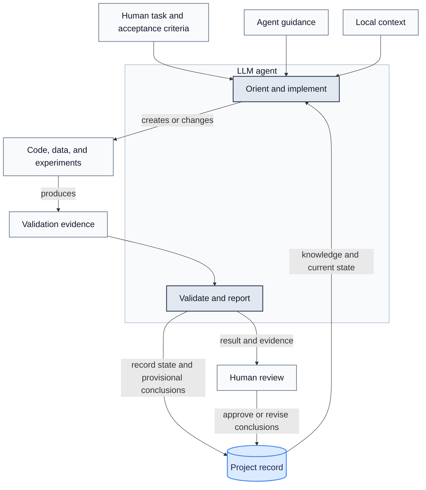

# Agentic Research Workflow: Knowledge, Rules, and State

This workflow lets **large language model (LLM) agents** continue work across
sessions while keeping a human in control. Version-controlled documentation
holds shared project memory. Humans remain responsible for scientific decisions,
consequential actions, and final results.

An agent needs three kinds of information:

1. **Knowledge:** facts about the project and its scientific context.
2. **Rules:** instructions for how work must be performed and which actions are
   prohibited. Some rules and engineering choices exist specifically to reduce
   the impact of LLM errors and fabricated claims.
3. **State:** what has already happened, what is currently in progress, and what
   remains to be verified.

These concerns need different storage. Tool-specific instruction files become
unwieldy when they contain everything, while chat history is not a durable
project record.

Keep durable knowledge and state **tool-neutral**. Store architecture, decisions,
findings, plans, and task state in ordinary project files. Tool-specific files
should point to that shared record, not replace it.

This reduces repeated prompting and gives agents stable facts. Keep the record
concise and current; duplicated or stale documents create conflicting context.

This chapter follows one sample project, which trains
image classifiers from sample manifests. The task is to reject duplicate sample
IDs before constructing a dataset, continuing the example in
[chapter 14](14_Programming_with_LLM_Agents.md#task-requests).
The setup, state records, prompts, and reusable workflow below all use this task.

The workflow applies across LLM agents. The supplementary
[shared documentation examples](../examples/ai_coding_examples/docs/) contain
the image-classifier architecture and sample plan, plus rules from a Python
mass-spectrometry project that need adaptation before use here. Agent-specific examples
remain in [claude/](../examples/ai_coding_examples/claude/) and
[copilot/](../examples/ai_coding_examples/copilot/).

LLM-agent products change frequently. Verify tool-specific feature details in the
official documentation for the agent being configured.

## Table of Contents

1. [Step-by-Step Setup](#step-by-step-setup)
2. [Three-Layer Model](#three-layer-model)
3. [Project Record](#project-record)
4. [Agent Guidance](#agent-guidance)
5. [Local Context](#local-context)
6. [Session Workflow](#session-workflow)
7. [Reusable Workflows](#reusable-workflows)
8. [System Audit](#system-audit)
9. [Further Reading](#further-reading)

## Step-by-Step Setup

The goal is to let a fresh agent continue the duplicate-ID task from repository
files. This sets up the workflow around an existing Python project; it does not
create the classifier or install an agent client. The example paths below belong
to the sample project, not to this documentation repository.

The guide stores shared example documents under
`examples/ai_coding_examples/docs/`; in your project, the equivalent location is
`docs/`. The shared example folder has `findings/`, `knowledge/`, `plans/`,
`rules/`, and `state/` directories. It includes architecture and rules examples
plus a [sample duplicate-ID plan](../examples/ai_coding_examples/docs/plans/duplicate-sample-ids.md)
for this chapter's image-classifier task. Use the templates below to populate
the other directories as work proceeds.

### 1. Establish the Starting Point

Assume Git and an agent client are installed, and the Python project already has:

```text
sample-project/
├── README.md
├── pyproject.toml
├── uv.lock
├── src/project/dataset.py
└── tests/test_dataset.py
```

For this example, the project uses uv, declares pytest and Ruff as development
dependencies, and configures imports so its tests can import `project`. Its
`Dataset` constructor consumes manifest rows containing `sample_id`, `path`, and
`split`. Adapt these assumptions to your actual project before copying the files.

Open a terminal at the project root. The following commands work in Bash or
PowerShell. `uv sync --dev` installs the project's development environment; the
remaining commands record the starting revision, local changes, and test result.
See the [uv project guide](https://docs.astral.sh/uv/guides/projects/).

```bash
uv sync --dev
git rev-parse HEAD
git status --short
uv run pytest tests/test_dataset.py -q
```

Keep the actual output for the task record. If setup or tests fail, record the
failure and resolve it before attributing failures to the duplicate-ID change.

### 2. Write the Shared Knowledge and Rules

Create `docs/`, `docs/rules/`, `docs/plans/`, `docs/state/`, and `docs/knowledge/`
in your editor.
Create `docs/architecture.md` with the following starting content, checking each
statement against the code first:

```markdown
# Sample project architecture

- Purpose: train image classifiers from sample manifests.
- Input: manifest rows with sample_id, path, and split fields.
- Entry point: Dataset in src/project/dataset.py.
- Data flow: manifest rows → validation → dataset construction → image loading.
- Focused tests: tests/test_dataset.py.
- Environment and baseline setup: see ../README.md.
```

Create `docs/rules/data-validation.md` with the agreed task constraints:

```markdown
# Manifest validation rules

- Preserve the Dataset constructor and manifest schema for this task.
- Preserve row order and existing split assignments.
- Compare sample IDs as exact strings; do not normalize case or Unicode.
- Reject duplicates with one ValueError listing every duplicated ID once.
- Validate identifiers without reading image contents.
- Use synthetic manifest rows in tests; do not modify research datasets.
```

Exact string comparison is a deliberate choice for this example, not a universal
rule for sample identity. Settle the equivalent decision with the project owner
before implementation. Add links to these two files and the verified setup
commands from step 1 to the project's `README.md`.

### 3. Create the First Task Record

Here, **duplicate sample IDs** means that multiple manifest rows share the same
`sample_id`; see the [sample project example](14_Programming_with_LLM_Agents.md#sample-project).
`duplicate-sample-ids.md` names the document tracking this task's plan, progress,
and validation results. It is not a dataset or a Python script.

Save the [task-state template below](#task-state) as
`docs/plans/duplicate-sample-ids.md`. Replace its date placeholder and record the
revision, working-tree status, and test output from step 1. Leave unperformed
work marked as pending.

Create `docs/state/project-state.md` as the short entry point to that plan:

```markdown
# Project state

## Active work

- [Reject duplicate sample IDs](../plans/duplicate-sample-ids.md): baseline recorded;
  regression test and implementation pending.

## Next action

Read the plan and data-validation rules, then propose the regression cases.
```

If the baseline failed, replace the status and next action with the actual blocker.
The index points to the evidence in the plan; it does not duplicate test logs.

### 4. Connect the Agent to the Record

For Codex, save the [entry-point example below](#tool-specific-entry-points) as
`AGENTS.md` at the project root. For Claude Code, save it as root `CLAUDE.md`.
If you use both, keep both short and point them to the same shared files. Merge
with existing instructions instead of overwriting them. See the
[Codex instruction guide](https://learn.chatgpt.com/docs/agent-configuration/agents-md)
and [Claude project-memory guide](https://code.claude.com/docs/en/memory).

Open a fresh agent session with the sample project root as its working directory. Send:

```text
Read the repository instructions, docs/architecture.md,
docs/rules/data-validation.md, docs/state/project-state.md, and its linked plan.
Inspect src/project/dataset.py, tests/test_dataset.py, and git status.
Summarize the duplicate-ID task, validation commands, and permitted changes.
Cite the files you read and flag any mismatch. Do not edit files yet.
```

Check the response against the files. A Markdown link alone is not evidence that
the agent read its target. Correct missing context before starting the task.
Review the client's active permissions as described under
[Advisory and Enforced Rules](#advisory-and-enforced-rules); this task needs local
code edits and tests, with synthetic inputs.

### 5. Run One Bounded Task

Use the prompts in [Session Workflow](#session-workflow) to define, plan, and
implement the duplicate-ID change. The expected cases are unique IDs, one repeated
ID, and multiple distinct repeated IDs. Include a check that validation does not
read image contents and that valid rows retain their order and split assignments.

After reviewing the plan, send:

```text
Implement the accepted duplicate-ID plan using the shared data-validation rules.
First add a regression test and run it to demonstrate the missing validation.
Confirm it fails for that reason, then implement the fix and run the checks in
the plan. Preserve unrelated changes. Update the plan with observed results,
including failures and checks you could not run. Leave changes uncommitted.
```

### 6. Record and Test the Handoff

Review the diff and actual test output. Have the agent update
`docs/plans/duplicate-sample-ids.md` and the active-work index, using the
[handoff template](#7-hand-off). Keep the task active if verification or review
is incomplete. Once reviewed and complete, mark the plan complete and remove it
from the active list. Commit the reviewed code, tests, and records together using
your normal Git workflow so another checkout can receive them.

Start a fresh session and send:

```text
Read the repository instructions and docs/state/project-state.md, then read
docs/plans/duplicate-sample-ids.md. Compare the recorded state with Git and the
current implementation. Report what was verified, what remains unresolved,
and the next action, citing evidence. Do not edit files.
```

The setup works when the new session can recover the task and its evidence
without your previous chat. Fix missing or stale records if it cannot.

### 7. Add Reuse When Needed

After completing the task, use [Reusable Workflows](#reusable-workflows) to save
the procedure as `docs/knowledge/validate-manifest.md`. Add a tool-specific skill
wrapper only if this procedure recurs. Create `docs/findings/` when there is a
supported conclusion to preserve, and experiment records when actual runs begin.
The remaining sections explain how to maintain and extend this setup.

## Three-Layer Model

Organize agent context into three layers:

| Layer                    | Purpose                                  | Examples                                           |
| ------------------------ | ---------------------------------------- | -------------------------------------------------- |
| **Project record** | Shared knowledge and durable state       | `docs/`, Git, experiment records                 |
| **Agent guidance** | How an agent finds information and works | `AGENTS.md`, `CLAUDE.md`, scoped rules, skills |
| **Local context**  | Temporary task context                   | Chat history, local memory, working notes          |

The project record is the source of truth. LLM-agent guidance should point to that
record rather than duplicate it. Local context can help an agent continue, but
it is not a durable or shared record.

The human defines the goal. The agent reads the record, performs bounded work,
and writes back verified state. The human reviews the result.



**Figure 1.** The agent receives the task, project record, guidance, and local
context as inputs. After doing and validating the work, it reports the result
and records the observed state. Conclusions remain provisional until a human
reviews and approves or revises them.

A simple test is whether another LLM agent can continue by reading the repository.
If not, the necessary knowledge or state should be written to `docs/` or another
documented project store.

Tool-specific examples appear only where implementations differ.

### Cross-Agent Layout

Keep shared records outside tool-owned directories. A repository used with
Claude Code and Codex might grow from the minimal setup into:

```text
sample-project/
├── AGENTS.md
├── CLAUDE.md
├── docs/
│   ├── architecture.md
│   ├── state/
│   │   └── project-state.md
│   ├── knowledge/
│   │   └── validate-manifest.md
│   ├── findings/
│   ├── plans/
│   │   └── duplicate-sample-ids.md
│   └── rules/
│       └── data-validation.md
├── .claude/
│   └── skills/
└── .agents/
    └── skills/
```

When adapting the included example:

1. Keep durable knowledge, findings, rules, plans, and state in shared `docs/` files.
2. Keep `AGENTS.md` and `CLAUDE.md` as short entry points to those files.
3. Put tool-specific rules, permissions, and skill wrappers in tool directories.
4. Remove personal paths and replace example commands only with verified ones.
5. Verify scientific constants and heuristics before treating them as rules.
6. Give long-running work a task-state record and narrow permissions.

The rest of this chapter builds these layers in that order. First, create the
tool-neutral project record. Next, configure each agent to find and follow that
record. Finally, treat session context as a convenience rather than evidence.

## Project Record

The `docs/` directory is the tool-neutral project record. Its files separate
stable project knowledge from changing plans, state, and findings:

| Path                      | Contents                                                               |
| ------------------------- | ---------------------------------------------------------------------- |
| `docs/architecture.md`  | Components, entry points, interfaces, and data flow                    |
| `docs/state/project-state.md` | Current priorities, active work, blockers, and links to detailed plans |
| `docs/knowledge/`       | Project explanations and reusable procedures for development, experiments, and operations |
| `docs/findings/`        | Verified observations, measurements, negative results, and conclusions |
| `docs/plans/`           | Plans and state records for bounded tasks or investigations            |
| `docs/rules/`           | Shared scientific, data-handling, and engineering constraints          |

These documents change at different rates. Architecture and shared rules may
remain stable for months, while project state or an active plan may change
several times in one day. Keep each fact in one canonical location and link to
it from the other documents.

### Shared Knowledge

Project knowledge includes architecture, terminology, data contracts,
experimental assumptions, verified findings, reusable procedures, and rules.
Place it according to its purpose instead of the agent that will read it.

#### Project Documentation

Use `docs/architecture.md` for the stable map of the codebase. Put repeatable
procedures in `docs/knowledge/`, supported conclusions in `docs/findings/`, and
shared constraints in `docs/rules/`. A rule should cite the architecture,
finding, policy, or decision that justifies it when that evidence is not obvious.
Use `README.md` for setup and navigation rather than duplicating detailed
project knowledge there.

These files are the shared interface between humans and LLM agents. They do
not depend on one vendor's memory format, installation, or session history.
Update them when the underlying fact changes, and link to the canonical document
instead of copying the same explanation into `CLAUDE.md`, `AGENTS.md`, Copilot
instructions, and several agent memories.

The example's
[architecture.md](../examples/ai_coding_examples/docs/architecture.md)
illustrates an architecture inventory. In a real project, verify it against the
repository and update it when files move. A stale inventory is worse than a
shorter document that identifies only stable boundaries and entry points.

### Task and Experiment State

State records where the work stands. Research projects need more than chat
history because code, data, experiments, and interpretations evolve at different
rates.

#### Types of State

1. **Repository state** is the current Git revision, branch, working-tree diff,
   and staged changes.
2. **Task state** records the objective, the plan, completed work, open
   questions, and next checks.
3. **Experiment state** records configurations, input identity, environment,
   execution status, logs, checkpoints, metrics, and failures.
4. **Conversation state** is the agent session transcript and loaded context.

Repository, task, and experiment state are ground truth that every agent should
read fresh rather than recall from private memory. Store durable records in
tool-neutral formats and documented locations so another LLM agent can take over.
Only committed, versioned parts are durable, while an uncommitted diff or a
running experiment is current but still provisional.

#### Task State

Use `docs/state/project-state.md` as a concise index of current work rather than a
complete history. For work that spans sessions, create a version-controlled
record under `docs/plans/` and link it from `docs/state/project-state.md`. A useful
plan format is the following initial record for the sample project. Replace angle-
bracket placeholders with observed values; they are not example test results:

```markdown
# Dataset validation state

> **Status:** ACTIVE
> **Updated:** <YYYY-MM-DD>

## Objective

Reject duplicate sample IDs before dataset construction without changing the
manifest schema.

## Established facts

- Validation begins in `src/project/dataset.py`.
- Constraints: [manifest validation rules](../rules/data-validation.md).
- Baseline revision: <git rev-parse HEAD output>.
- Baseline working tree: <git status --short output, or clean>.
- Baseline focused tests: <command, exit code, and observed summary>.

## Plan

- Report all duplicate IDs in one error.
- Do not read sample contents during manifest validation.

## Completed

- Shared architecture, rules, and task index created.

## Current state

- Regression test and implementation pending; no fix has been verified.

## Next checks

1. Add a duplicate-ID regression test and confirm it fails for the intended reason.
2. Implement validation, then run `uv run pytest tests/test_dataset.py -q`.
3. Run `uv run pytest tests -q`.
4. Run `uv run ruff check src/project/dataset.py tests/test_dataset.py`.
5. Review the diff for changes to dataset splitting and image loading.

## Open questions

- None at setup; record any conflict between the rules and existing behavior.
```

Write facts as facts and unresolved ideas as questions or hypotheses. Update the
plan at meaningful checkpoints, not after every small tool call. When work ends,
record the final validation result, link any durable conclusion under
`docs/findings/`, and remove the plan from the active list in
`docs/state/project-state.md`. Keep the plan when its history remains useful.

#### Experiment State

An experiment record should contain enough information to reproduce or explain
the run:

- code revision and dirty-working-tree status;
- environment or lock-file identity;
- dataset version, manifest, and provenance;
- complete configuration and command-line arguments;
- random seeds and determinism settings;
- hardware, accelerator, and scheduler allocation;
- start time, completion status, and exit reason;
- log, checkpoint, and result locations; and
- metrics with their definitions and aggregation method.

Do not ask an LLM agent to infer missing provenance after the run. Capture it
when the experiment starts. Link active runs from `docs/state/project-state.md` when
they affect current work, and write supported conclusions or negative results
to `docs/findings/`. Keep raw logs, checkpoints, and large outputs in their
documented data locations rather than committing them to `docs/`. An agent hook
may load current task context, while experiment wrappers should record execution
metadata independently of any LLM agent.

For the sample project, the duplicate-ID fix needs a task record and test evidence,
but no training run. If you later retrain using the validated manifest, record
its identity and the code revision containing the fix with that run. Passing
validation tests alone does not establish improved classifier performance.

## Agent Guidance

Agent guidance tells a particular tool where to find the project record and how
to operate. Keep this layer concise and separate advisory instructions from
controls enforced by the runtime or operating system.

### Tool-Specific Entry Points

Each LLM-agent tool may have a preferred instruction file. Use that file as a
thin entry point containing information the LLM agent needs in nearly every
session. For Claude Code this is `CLAUDE.md` or `.claude/CLAUDE.md`; Codex uses
`AGENTS.md`; GitHub Copilot can use `.github/copilot-instructions.md`. Other
LLM-agent tools may use another format.

| Tool           | Repository entry point                 | More specific guidance                              |
| -------------- | -------------------------------------- | --------------------------------------------------- |
| Claude Code    | `CLAUDE.md` or `.claude/CLAUDE.md` | Nested`CLAUDE.md` files and `.claude/rules/`    |
| Codex          | `AGENTS.md`                          | Nested`AGENTS.md` or `AGENTS.override.md` files |
| GitHub Copilot | `.github/copilot-instructions.md`    | `.github/instructions/*.instructions.md`          |

Claude Code and Codex both combine instructions according to their own discovery
rules. Do not assume that nesting, precedence, or import syntax is identical.
Verify the behavior in the tool's current documentation.

The entry point should contain:

- the project's purpose and main scientific task;
- the canonical documentation paths;
- the supported environment and routine validation commands;
- important architectural boundaries;
- the location and policy for data, configurations, and results; and
- a small set of universal workflow rules.

Prefer links or imports to shared documentation over copied content. A
tool-specific entry should say where authoritative knowledge lives and when the
LLM agent must read it. If a fact would also help another LLM agent or a human
collaborator, put the fact in `docs/` first.

For the setup walkthrough, save this at the repository root as `AGENTS.md` or
`CLAUDE.md`, according to the agent you use:

```markdown
# Project context

This project trains image classifiers from sample manifests.

## Canonical knowledge

- Architecture and entry points: [docs/architecture.md](docs/architecture.md)
- Active work and plans: [docs/state/project-state.md](docs/state/project-state.md)
- Shared constraints: [manifest rules](docs/rules/data-validation.md)

## Environment and validation

- Use the uv project environment; setup is documented in README.md.
- Focused tests: `uv run pytest tests/test_dataset.py -q`
- Full tests: `uv run pytest tests -q`
- Lint for this task: `uv run ruff check src/project/dataset.py tests/test_dataset.py`

## Workflow

- Read architecture, shared constraints, project state, and the active plan
  before editing. Read docs/knowledge/validate-manifest.md when it exists and
  the task concerns manifest validation.
- State assumptions and distinguish evidence from hypotheses.
- Make only changes required by the task.
- Do not commit, submit cluster jobs, or modify datasets unless requested.
```

The included [CLAUDE.md](../examples/ai_coding_examples/claude/CLAUDE.md)
provides a good behavioral core that can also be adapted to `AGENTS.md`: think
before acting, prefer simplicity, make surgical changes, and define verifiable
success criteria. Add repository facts to that core, but keep long procedures
elsewhere.

Claude Code loads `CLAUDE.md`, while Codex constructs an instruction chain from
applicable `AGENTS.md` files before it starts work. In both cases, concise and
specific instructions are easier to maintain than a long handbook. See the
[Claude memory guide](https://code.claude.com/docs/en/memory) and
[Codex `AGENTS.md` guide](https://learn.chatgpt.com/docs/agent-configuration/agents-md).

### Scoped Instructions

Use the agent's scoped-instruction mechanism for language-, directory-, or
task-specific knowledge. In Claude Code, place topic files under
`.claude/rules/`. A rule without path frontmatter loads in every session; a
path-scoped rule loads when Claude works with matching files.

```markdown
---
paths:
  - "src/**/*.py"
  - "tests/**/*.py"
---

# Python rules

- Read docs/rules/data-validation.md before changing manifest validation.
- Keep synthetic manifest cases in tests/test_dataset.py.
- Run the validation commands in the repository-root instruction file.
```

The shared example rules already separate:

- [testing](../examples/ai_coding_examples/docs/rules/testing.md);
- [formatting](../examples/ai_coding_examples/docs/rules/formatting.md);
- [imports](../examples/ai_coding_examples/docs/rules/import-conventions.md); and
- [environment selection](../examples/ai_coding_examples/docs/rules/environment.md).

Keep these canonical documents under `docs/rules/`. When Claude needs scoped
guidance, put a short entry under `.claude/rules/` that directs it to the relevant
shared document, as in the snippet above. Other agents should read the same
shared rules through their own entry points.

For Codex, place shared guidance in the repository-root `AGENTS.md` and add a
nested `AGENTS.md` only when a directory needs more specific instructions. Use
`AGENTS.override.md` when the local guidance should replace the regular file at
that directory level. For example:

```text
project-root/
├── AGENTS.md
├── src/
│   └── AGENTS.md
└── experiments/
    └── AGENTS.override.md
```

Codex reads from the project root toward the current working directory, so the
more specific file appears later in its instruction chain. Codex `.rules` files
serve a different purpose: they control which commands may run outside the
sandbox and should not be used as substitutes for project knowledge.

### Advisory and Enforced Rules

Rules answer how an LLM agent should work. Separate guidance that requires
judgment from controls that must apply regardless of the model's interpretation.

#### Behavioral Rules

Use the tool-specific instruction entry point and scoped instruction files for
rules such as:

- explain assumptions before implementing ambiguous scientific behavior;
- preserve existing interfaces unless a migration is requested;
- avoid unrelated formatting and refactoring;
- write a regression test before fixing a reproducible bug;
- distinguish measured results from interpretations; and
- report which validation commands were actually run.

The example's
[git workflow rule](../examples/ai_coding_examples/docs/rules/git-workflow.md)
uses this approach to keep commits under human control. This is particularly
useful when Git revisions are used as experiment provenance.

#### Enforced Rules

An instruction such as "never read `.env`" is a request to the model. If the
action must be blocked, use the LLM-agent runtime, operating system, sandbox, or
CI to enforce it.

- In Claude Code, configure allow, ask, and deny permissions in
  `.claude/settings.json`, and review the result with `/permissions`.
- In Codex, use its sandbox and approval settings. Experimental Codex `.rules`
  files can control which matching commands may run outside the sandbox.
- For every tool, retain operating-system permissions, secret management, and
  CI protection as independent security boundaries.

Keep allow rules narrow because they remove per-use prompts or sandbox
restrictions. Verify current behavior in the
[Claude Code permission documentation](https://code.claude.com/docs/en/permissions)
or [Codex rules documentation](https://learn.chatgpt.com/docs/agent-configuration/rules).

Use a hook when an action must run at a lifecycle event, such as formatting
after an edit. Unlike instructions, hooks are deterministic. Keep them fast,
idempotent, and safe with untrusted input. If the agent has no suitable hook,
use a repository script, pre-commit check, or CI. See the
[Claude Code hooks guide](https://code.claude.com/docs/en/hooks-guide).

#### Rule Consistency

Conflicting rules make agent behavior unpredictable. Maintain one canonical
rule for each concern:

| Concern                        | Preferred source          |
| ------------------------------ | ------------------------- |
| Universal project workflow     | Tool-specific entry point |
| Python or directory convention | Path-scoped rule          |
| Hard tool or file restriction  | Permission setting        |
| Deterministic lifecycle action | Hook                      |
| Multi-step task procedure      | Skill                     |

When a rule changes, search all instruction files and remove obsolete copies.
Rules should describe the target repository's actual configuration. For example,
do not state that Black, isort, and Ruff are all required unless their settings
and validation commands agree in the repository.

## Local Context

Chat history and agent-local memory can make a session convenient to resume, but
they may be stale, incomplete, or machine-specific. They are caches, not a
reproducible project record.

Local memory is appropriate for:

- a command that is repeatedly useful on one workstation;
- a local debugging observation that has not yet been confirmed; or
- a personal preference about how results are displayed.

Move team knowledge, decisions, workarounds, and task state into the repository.
Use `/memory` in Claude Code or `/memories` in supporting Codex clients to review
local memory. Do not write shared workflows to a user's absolute memory path;
that storage is non-portable and owned by the individual agent installation.

### Evidence-Based Resumption

Transcripts help continue interrupted work but may be stale. Start resumed work
by checking:

```text
1. Read the current task-state document.
2. Inspect git status and the relevant diff.
3. Compare the repository with assumptions in the task state.
4. Report any mismatch before making changes.
```

For this task, read `docs/plans/duplicate-sample-ids.md` even if local memory says
the fix is done. If the record says tests are pending, check the current code and
run the documented checks before marking them passed.

See the Claude [session guide](https://code.claude.com/docs/en/sessions) and
Codex [memory guide](https://learn.chatgpt.com/docs/customization/memories) for
tool-specific continuation features.

Use multiple agents only when tasks can proceed independently with clear
ownership; one agent may handle several roles sequentially. For concurrent
tasks, use separate Git worktrees. Call a review independent only when the
reviewer did not perform the work being reviewed.

## Session Workflow

The following lifecycle keeps knowledge, rules, and state synchronized.

### 1. Orient

The LLM agent should read the relevant instructions and durable state before
planning:

```text
Read the repository's agent instructions, docs/state/project-state.md,
docs/plans/duplicate-sample-ids.md, and docs/rules/data-validation.md.
Inspect git status and the existing implementation. Summarize the current state,
identify conflicts with the state document, and do not edit files yet.
```

The user verifies that the LLM agent found the correct environment, files, and
task.

### 2. Define

Convert the request into observable success criteria:

```text
Objective: reject duplicate sample IDs before dataset construction.

Constraints:
- Preserve the public Dataset constructor and manifest schema.
- Do not change dataset splitting.
- Report all duplicates in one error.
- Use the exact string comparison defined in docs/rules/data-validation.md.
- Do not read image contents during manifest validation.

Verification:
- A regression test fails before the fix and passes afterward.
- Focused and complete test suites pass.
- The final diff contains no unrelated changes.
```

Ambiguous scientific choices remain open questions until a person or repository
source resolves them.

### 3. Plan

For a multi-file or scientifically consequential task, enter Plan mode or ask
for a read-only plan. The plan should name files, risks, expected state changes,
and checks. Store the accepted plan when the work will span sessions or involve
other collaborators.

### 4. Implement

Make the smallest change that produces a testable result. After each meaningful
increment, inspect the diff and run the narrowest relevant check. Do not combine
a scientific change, dependency upgrade, and broad refactor into one increment.

### 5. Validate

Validate software behavior and scientific meaning separately:

- tests, linting, types, error paths, and compatibility;
- data provenance, leakage, units, metrics, baselines, and interpretation.

The LLM agent must report observed command results rather than claiming a
command was run. Generated scientific explanations and chemical assignments remain
hypotheses until supported by repository evidence or an authoritative source.

### 6. Update State

Before ending the session, update the relevant task or experiment record with:

- what changed;
- the plan followed and why;
- validation that passed or failed;
- unresolved questions;
- working-tree or artifact locations; and
- the next concrete action.

Do not store ephemeral narration or the entire chat transcript. Preserve only
information another person or fresh session needs to continue correctly.

### 7. Hand Off

A useful handoff is short and evidence-based. Fill in this template from the
actual diff and command output; leave checks marked as not run when appropriate:

```text
Changed:
- src/project/dataset.py: <actual implementation change>.
- tests/test_dataset.py: <actual regression cases added>.

Verified:
- Focused tests: <command, exit code, and observed summary, or not run>.
- Full tests: <command, exit code, and observed summary, or not run>.
- Ruff: <command, exit code, and observed summary, or not run>.

Not verified:
- <remaining checks or unresolved questions, or none>.

State:
- Git revision and working tree: <current revision and uncommitted changes>.
- docs/plans/duplicate-sample-ids.md: <status, evidence, and next action>.
- docs/state/project-state.md: <active entry updated, or removed after completion>.
```

## Reusable Workflows

For repeated tasks, keep a version-controlled runbook and add a `SKILL.md`
wrapper for each supporting agent. The runbook remains readable by humans and
tools that do not load the skill.

| Agent       | Project skill location             | Explicit invocation                 |
| ----------- | ---------------------------------- | ----------------------------------- |
| Claude Code | `.claude/skills/<name>/SKILL.md` | `/<name>`                         |
| Codex       | `.agents/skills/<name>/SKILL.md` | `$<name>` or the `/skills` menu |

Skill discovery, invocation, and permissions remain tool-specific.

A research skill should specify:

- trigger conditions and inputs;
- authoritative project files and data sources;
- preconditions and steps;
- evidence required for each classification or conclusion;
- permissions, outputs, and state updates; and
- validation and stopping conditions.

For the sample project, create `docs/knowledge/validate-manifest.md` after the first
task has established a procedure worth repeating:

```markdown
# Validate a manifest change

## Inputs

- The requested behavior and active plan linked from ../state/project-state.md.
- The current implementation in src/project/dataset.py (from repository root).
- The shared constraints in ../rules/data-validation.md.

## Procedure

1. Inspect the implementation, focused tests, and current Git diff.
2. Resolve conflicts with the shared constraints before editing.
3. Add synthetic regression cases and verify the intended failure.
4. Make the bounded fix; run the checks in the root agent instructions.
5. Review schema, row order, split assignments, and image-reading behavior.
6. Update the active plan with commands, exit codes, and observed results.

## Outputs and stopping conditions

- Produce a reviewable code/test diff and an updated task record.
- If a check fails or cannot run, record the blocker and leave the task active.
- Do not modify research datasets or start training as part of this procedure.
```

Paths in the procedure are resolved as stated; run its commands from the
repository root. Save this thin wrapper in
`.agents/skills/validate-manifest/SKILL.md` for Codex or
`.claude/skills/validate-manifest/SKILL.md` for Claude Code:

```markdown
---
name: validate-manifest
description: Use when implementing or reviewing sample-manifest validation changes.
---

# Validate a sample-manifest change

Read docs/knowledge/validate-manifest.md from the repository root and follow it.
Use the active plan linked from docs/state/project-state.md for task-specific inputs.
If no task is specified, ask for the intended validation change before editing.
Update task state after the attempt, including failed validation. Promote a
conclusion to docs/findings/ only after the relevant validation succeeds.
```

Invoke it with `$validate-manifest` in Codex or `/validate-manifest` in Claude
Code, followed by the requested change. Check that the agent reads the runbook
before acting. Keep permissions and invocation controls in the tool-specific
configuration. See
[Claude Code skills](https://code.claude.com/docs/en/slash-commands) and
[Codex skills](https://learn.chatgpt.com/docs/build-skills).

The example's legacy [`commands/`](../examples/ai_coding_examples/claude/commands/)
can be converted into thin skills that share the same runbook and scripts.

## System Audit

Audit the same layers regardless of which LLM agent is used:

| Layer        | Question to answer                                                                    |
| ------------ | ------------------------------------------------------------------------------------- |
| Instructions | Which repository and user instruction files were loaded, in what order?               |
| Knowledge    | Does every required fact resolve to a current, shared source?                         |
| State        | Can a new human or agent identify the current goal, evidence, and next action?        |
| Skills       | Which reusable workflows are discoverable, and are their inputs and outputs explicit? |
| Permissions  | Which actions are allowed, prompted, sandboxed, or forbidden?                         |
| Automation   | Which hooks, scripts, and CI checks can change or validate work?                      |
| Tools        | Which external services, environments, and data stores are available?                 |

Use the tool's own inspection features for the implementation details:

| Concern                       | Claude Code                    | Codex                                                                                              |
| ----------------------------- | ------------------------------ | -------------------------------------------------------------------------------------------------- |
| Instructions and local memory | Inspect with`/memory`        | Check the applicable`AGENTS.md` chain; inspect local memories with `/memories` where supported |
| Skills                        | Inspect with`/skills`        | Inspect with`/skills` or explicitly invoke `$<skill-name>`                                     |
| Permissions                   | Inspect with`/permissions`   | Review sandbox and approval settings, plus any applicable`.rules` files                          |
| Configuration                 | Use`/doctor` and `/status` | Review the active Codex client configuration and repository instructions                           |

For the sample project, use the fresh-session check in setup step 6 as the first
audit: can the agent locate the duplicate-ID plan, explain exact string matching,
and identify the actual test evidence? If you add the skill, also verify that its
wrapper resolves to `docs/knowledge/validate-manifest.md`.

Audit the workflow periodically:

- remove stale or duplicated knowledge;
- promote useful local memory into version-controlled documentation;
- close or update abandoned task-state records;
- verify that documented commands still run;
- test permission rules and hooks in a safe environment;
- review skills for excessive permissions and stale paths; and
- confirm that experiment records still identify their code, data, and
  environment.

For tool-specific diagnostics, see the
[Claude Code configuration debugging guide](https://code.claude.com/docs/en/debug-your-config)
and the [Codex `AGENTS.md` guide](https://learn.chatgpt.com/docs/agent-configuration/agents-md).

## Further Reading

### Codex

- [Codex `AGENTS.md`](https://learn.chatgpt.com/docs/agent-configuration/agents-md)
- [Codex skills](https://learn.chatgpt.com/docs/build-skills)
- [Codex memories](https://learn.chatgpt.com/docs/customization/memories)
- [Codex command rules](https://learn.chatgpt.com/docs/agent-configuration/rules)

### Claude Code

- [How Claude remembers a project](https://code.claude.com/docs/en/memory)
- [Extend Claude Code](https://code.claude.com/docs/en/features-overview)
- [Explore the `.claude` directory](https://code.claude.com/docs/en/claude-directory)
- [Configure permissions](https://code.claude.com/docs/en/permissions)
- [Automate workflows with hooks](https://code.claude.com/docs/en/hooks-guide)
- [Extend Claude with skills](https://code.claude.com/docs/en/slash-commands)
- [Manage Claude Code sessions](https://code.claude.com/docs/en/sessions)
- [Debug Claude Code configuration](https://code.claude.com/docs/en/debug-your-config)
